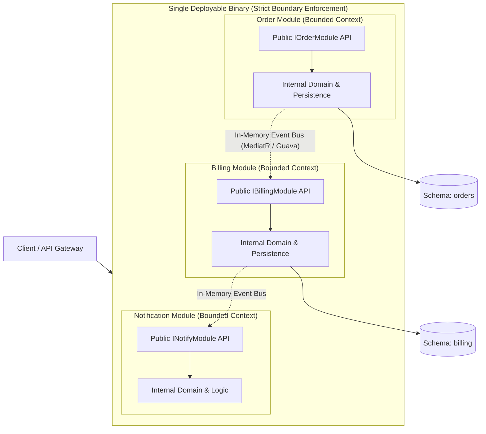

# Modular Monolith Architecture

## Overview
A **Modular Monolith** is an architectural style where a software system is structured as a single deployable artifact, but whose internal codebase is strictly partitioned into independent, loosely coupled, and highly cohesive domain modules with rigidly enforced public interfaces and private database boundaries.

## Problem It Solves
Provides the structural decoupling, independent team ownership, and domain isolation of microservices **without the brutal operational complexity, network latency, partial failures, and distributed transaction headaches** of distributed systems.

## Context
The modern recommended architecture for mature organizations, mid-market enterprises, and high-scale systems that require strict boundary discipline without the operational overhead of managing 50 Kubernetes microservices.

## Structure
Single OS process, but code is divided into compile-time isolated projects/packages with strictly enforced public API contracts.

## Diagram

## Components
* **Host Application**: Lightweight bootstrap shell that configures dependency injection, runs web servers, and loads modules.
* **Domain Modules**: Self-contained assemblies/packages representing DDD Bounded Contexts.
* **Public Contracts Module**: Defines strictly typed interfaces, DTOs, and event payloads exposed by each module.
* **In-Memory Event Broker**: Decouples cross-module communication using asynchronous in-memory event dispatching (e.g., MediatR in .NET, ApplicationEventPublisher in Spring).

## Communication Model
* **Synchronous**: Direct in-memory method invocation via strongly typed public interfaces (`IOrderModule`).
* **Asynchronous**: In-process domain events published to an in-memory mediator. Zero network latency; nanosecond execution.

## Data Strategy
Single physical database instance, but with **strictly segregated database schemas** (e.g., `orders.*` vs. `billing.*`). Cross-schema SQL joins and direct foreign keys are forbidden; boundaries are enforced via ArchUnit or linters.

## Benefits
* **Zero Distributed Systems Penalty**: No network hops, no serialization latency, no distributed transactions (Sagas), no network partitions.
* **High Development Velocity**: Full system compiles together; instantaneous refactoring with IDE rename tools; end-to-end integration tests execute in seconds locally.
* **Clear Extraction Pathway**: If a module (e.g., Billing) ever genuinely needs to scale independently, it can be sliced out into a standalone microservice in days because its boundaries are already strictly enforced!

## Disadvantages
* **Single Deployment Artifact**: Redeploying one module requires redeploying the entire host container.
* **Tech Stack Uniformity**: All modules must run on the same runtime platform (.NET, Java, or Node.js).
* **Requires Relentless Architectural Discipline**: Without automated architecture fitness tests, developers will succumb to the temptation of referencing internal classes across modules.

## When to Use
* Enterprise applications requiring high modularity and clean domain boundaries.
* Teams with 10 to 100 engineers seeking high feature velocity without hiring large dedicated platform/SRE teams.
* High-throughput transactional platforms where network latency between microservices is unacceptable.

## When NOT to Use
* Organizations with multiple independent global engineering squads that strictly require autonomous daily deployment cadences.
* Systems requiring disparate programming languages or specialized compute hardware (e.g., Python AI GPU nodes mixed with Java business logic).

## Scalability
* High horizontal scalability. Run multiple instances of the modular monolith behind a load balancer.

## Reliability
* High internal reliability. However, an unhandled crash or out-of-memory error inside one module can still terminate the host process.

## Security
* Fine-grained internal authorization: Modules can enforce role checks at their public entry points.

## Observability
* Single-process telemetry. Tracing is seamless and trivial; execution context flows through memory without requiring distributed trace injection.

## Operational Complexity
* Low. Single CI/CD pipeline, single container deployment, single database backup schedule.

## Cost
* Highly cost-efficient. Maximizes CPU and memory density; minimizes cloud compute and network egress spend.

## Migration Considerations
* The ideal target architecture for refactoring legacy spaghetti monoliths.
* The ideal stepping stone prior to microservices adoption.

## Trade-offs
* **Gains**: Maximum modularity, zero network latency, simple operations, high developer ergonomics.
* **Sacrifices**: Independent deployment autonomy across individual modules.

## Related Patterns
* [Monolithic Architecture](monolithic.md)
* [Microservices](microservices.md)
* [Hexagonal Architecture](hexagonal.md)
