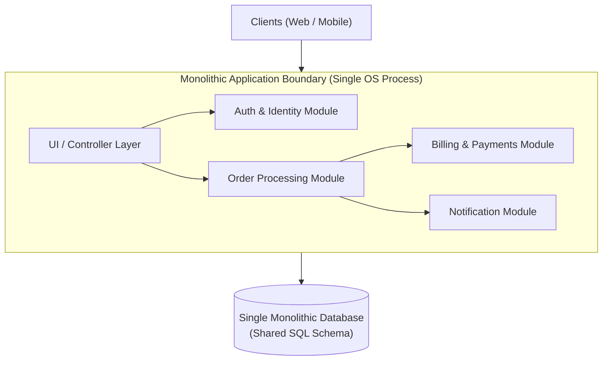

# Monolithic Architecture

## Overview
A **Monolithic Architecture** builds a software system as a single, unified, self-contained executable artifact where user interface, business logic, background processing, and database data access layers are packaged, compiled, and deployed together as a single binary unit.

## Problem It Solves
Maximizes developer velocity during early product phases by eliminating network latency between components, avoiding distributed data consistency issues, and drastically simplifying local debugging, testing, and deployment.

## Context
Default starting architecture for virtually all early-stage greenfield startups and small-to-medium enterprise solutions.

## Structure
All business domains and modules reside within the same operating system process, executing in shared memory.

## Diagram

## Components
* **Single Deployment Unit**: Single `.war`, `.dll`, or Docker container image containing 100% of application code.
* **In-Memory Function Calls**: Modules communicate via direct memory references and method invocations.
* **Unified Database**: Shared relational schema with cross-module table foreign keys and joins.

## Communication Model
Strictly in-memory, synchronous method invocations. Maximum execution speed; nanosecond latency.

## Data Strategy
Single unified relational database with global ACID transactions. Transactions span multiple business modules using simple local database locks.

## Benefits
* **Simplicity**: Trivial to run locally; developers clone one repository, press "Run", and debug end-to-end.
* **Zero Network Overhead**: No network hops, serialization, or distributed tracing required between internal modules.
* **Simple Testing & Deployment**: End-to-end integration tests run locally; single artifact deployed via simple CI/CD.

## Disadvantages
* **The "Big Ball of Mud" Risk**: Without rigorous code governance, internal boundaries dissolve into tangled spaghetti dependencies.
* **Deployment Coupling**: A one-line bug fix in the notification module requires compiling, testing, and redeploying the entire billion-dollar payment core.
* **Scalability Bottleneck**: The entire monolith must be scaled horizontally together, even if only one small CPU-intensive image resizing function is saturated.
* **Tech Stack Lock-In**: Difficult to adopt new programming languages or runtimes for specific subproblems.

## When to Use
* Early-stage products, startups, and greenfield systems where product-market fit is still evolving.
* Small to mid-sized engineering teams (< 20 engineers) working on a cohesive product.
* Workloads where domain boundaries are ambiguous or rapidly changing.

## When NOT to Use
* Large enterprise organizations with hundreds of engineers distributed across multiple global squads (causes continuous Git merge conflicts and deployment gridlocks).
* Systems with wildly divergent scalability, security, or hardware requirements across domains.

## Scalability
* Horizontally scaled by running multiple identical clones of the monolith behind an Application Load Balancer.
* Database write scaling is the hard bottleneck.

## Reliability
* A memory leak, unhandled exception, or CPU spike in any single module (e.g., a PDF generator) can crash the entire OS process, bringing down the entire platform.

## Security
* Monolithic trust boundary: Any component compromised inside the process has access to all shared memory and database connection strings.

## Observability
* Extremely straightforward. Standard APM profilers (Datadog, Dynatrace) capture complete stack traces and execution flame graphs from a single process.

## Operational Complexity
* Lowest possible operational complexity. Single build pipeline, single health probe, single container.

## Cost
* Highly cost-efficient. Minimal cloud resource waste; high CPU and RAM utilization on shared hosts.

## Migration Considerations
* If scaling bottlenecks occur, refactor internally into a **Modular Monolith** first before considering microservices.

## Trade-offs
* **Gains**: Extreme developer velocity, simple operations, ACID transactions, nanosecond inter-module latency.
* **Sacrifices**: Long-term organizational scalability, deployment autonomy, and fault isolation.

## Related Patterns
* [Modular Monolith](modular-monolith.md)
* [Microservices](microservices.md)
* [Layered Architecture](layered-architecture.md)
