# Pipe-and-Filter Architecture

## Overview
The **Pipe-and-Filter Architecture** decomposes a complex data processing task into a sequence of discrete, reusable, and independent processing steps called **Filters**, connected by data communication channels called **Pipes**, where the output of one filter serves as the input to the next.

## Problem It Solves
Solves the challenge of processing continuous data streams, multi-stage ETL pipelines, video encoding, and compiler transformations in a modular, reusable, and independently testable manner.

## Context
Data engineering pipelines, Unix shell commands (`cat | grep | awk`), compiler toolchains (LLVM), audio/video encoding (FFmpeg), and telemetry stream processing.

## Structure
Source $\to$ Pipe $\to$ Filter 1 $\to$ Pipe $\to$ Filter 2 $\to$ Pipe $\to$ Sink.

## Diagram

```mermaid
flowchart LR
    Source["Data Ingestion Source\n(Raw Telemetry / Video)"] --> Pipe1["Pipe 1 (Buffer / Stream)"]
    Pipe1 --> F1["Filter 1: Validation & Sanitization"]
    F1 --> Pipe2["Pipe 2 (Buffer / Queue)"]
    Pipe2 --> F2["Filter 2: Encryption & Enrichment"]
    F2 --> Pipe3["Pipe 3 (Buffer / Stream)"]
    Pipe3 --> F3["Filter 3: Compression & Aggregation"]
    F3 --> Sink["Data Sink (S3 / Lakehouse)"]
```

## Components
* **Filter**: Pure, self-contained transformation component. Reads from an input pipe, transforms data, and writes to an output pipe. Filters know nothing about preceding or subsequent filters.
* **Pipe**: Unidirectional communication channel (in-memory buffer, Unix pipe, Kafka topic, or queue) that buffers and transfers data between filters.
* **Source & Sink**: The starting data generator and the final persistent destination.

## Communication Model
Unidirectional, streaming, asynchronous data flow. Data flows continuously in chunks or streams.

## Data Strategy
Streaming data. Each filter transforms the message payload (e.g., raw bytes to decoded JSON, JSON to enriched object).

## Benefits
* **High Reusability & Composition**: Filters can be reordered, swapped, or combined into new pipelines with zero code modifications.
* **Parallel & Concurrent Execution**: Filters can execute concurrently on separate CPU cores or machines (Filter 2 processes message #1 while Filter 1 is already processing message #2).
* **Isolated Testability**: Each filter is a pure transformation function that can be unit-tested in isolation by mocking input/output streams.

## Disadvantages
* **Serialization & Parsing Overhead**: If data must be serialized and deserialized into JSON/bytes between every filter, performance degrades.
* **Lowest Common Denominator Data Format**: Requires all filters to agree on standard pipe data schemas.
* **Error Handling & State Rollbacks**: If Filter 4 fails halfway through a 10-step pipeline, rolling back previous state transformations across intermediate pipes is extremely complex.

## When to Use
* Data pipelines, ETL/ELT batch and stream processing (Apache Spark, Apache Flink).
* Compilers, parser generators, and media transcoding pipelines.
* Enterprise message enrichment and validation pipelines.

## When NOT to Use
* Interactive, bidirectional request-reply web applications (e.g., standard CRUD portals).
* Workloads requiring complex, multi-party transactional negotiations.

## Scalability
* High. Individual bottleneck filters can be scaled horizontally by running multiple parallel worker threads or distributed consumers.

## Reliability
* High if pipes are backed by durable message queues (Kafka / RabbitMQ); dropped messages can be reprocessed.

## Security
* Security filtering: Individual filters can enforce virus scanning, PII tokenization, or payload signature verification.

## Observability
* Measured by throughput (records/sec), pipeline stage latency, and pipe buffer queue depth.

## Operational Complexity
* Low for in-memory pipelines; moderate to high for distributed multi-cluster streaming pipelines.

## Cost
* Highly cost-efficient. Maximizes CPU utilization through pipeline parallelism.

## Migration Considerations
* Easy to evolve monolithic batch processing scripts into modular pipe-and-filter pipelines.

## Trade-offs
* **Gains**: Modularity, reusability, concurrent stream throughput, clean separation of concerns.
* **Sacrifices**: Complex transactional error recovery, serialization overhead across stages.

## Related Patterns
* [Event-Driven Architecture](event-driven-architecture.md)
* [Microservices](microservices.md)
