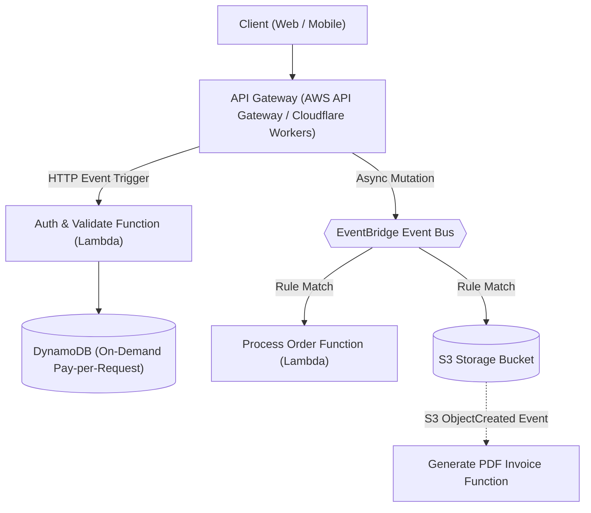

# Serverless Architecture Style

## Overview
A **Serverless Architecture Style** builds and runs entire software applications without provisioning, configuring, or managing servers, relying instead on cloud-managed Function-as-a-Service (FaaS), Backend-as-a-Service (BaaS), managed event routers, and serverless persistence layers that scale automatically on demand and scale to zero when idle.

## Problem It Solves
Eliminates infrastructure provisioning toil, server patching, idle VM capacity waste, and manual capacity planning, allowing engineering teams to focus 100% of their effort on business logic.

## Context
High-velocity product teams, unpredictable burst workloads, event-driven integrations, startups, and enterprise edge compute.

## Structure
Client $\to$ Edge / API Gateway $\to$ Ephemeral FaaS Functions $\to$ Serverless Event Routers $\to$ Serverless Data Stores.

## Diagram

## Components
* **API Gateway / Edge Router**: Ingress proxy that triggers stateless functions in response to HTTP requests.
* **Ephemeral Compute (FaaS)**: AWS Lambda, Azure Functions, Cloudflare Workers running isolated functions.
* **Serverless Event Bus**: AWS EventBridge, SQS, SNS routing events between functions.
* **Serverless Storage & Persistence**: DynamoDB, Aurora Serverless v2, S3, Azure Cosmos DB.

## Communication Model
Predominantly asynchronous event-driven, with synchronous HTTP/REST at the edge ingress.

## Data Strategy
Managed serverless persistence engines with auto-scaling compute and storage (e.g., DynamoDB with On-Demand capacity mode).

## Benefits
* **Zero Idle Cost**: Scale-to-zero economics. If zero users access the application at night, the compute bill is exactly $0.00.
* **Zero Infrastructure Management**: Cloud provider handles OS patching, server clustering, network routing, and hardware failover.
* **Effortless Elastic Scaling**: Functions scale from 0 to 1,000 concurrent instances in seconds in response to viral spikes.

## Disadvantages
* **Cold Starts**: Latency spikes on initial function invocation (can be 500ms to 3,000ms for heavy language runtimes).
* **Vendor Lock-In**: Heavy coupling to proprietary cloud provider APIs and event formats (AWS EventBridge, DynamoDB Streams).
* **Local Testing & Debugging Friction**: Simulating a complex distributed mesh of 30 Lambdas, S3 events, and SQS queues locally on a developer laptop is notoriously difficult.
* **Execution Time Limits**: Hard timeouts (e.g., AWS Lambda terminates after 15 minutes), making it unsuitable for long-running batch jobs or streaming sockets.

## When to Use
* Unpredictable, bursty, or spiky traffic patterns.
* Asynchronous data processing pipelines (file processing, image transformation, event streaming).
* Lightweight APIs, micro-frontends, and rapid MVPs.

## When NOT to Use
* High-frequency trading or ultra-low latency APIs requiring guaranteed `< 5ms` p99 SLAs.
* 24/7 sustained high-throughput workloads (> 1,000 sustained RPS), where provisioned container clusters (EKS) are drastically cheaper.
* Long-running computational batch algorithms exceeding 15 minutes.

## Scalability
* Extreme horizontal elasticity. Scales automatically based on incoming event rates, bounded only by account concurrency quotas.

## Reliability
* High. Managed entirely by multi-AZ cloud provider infrastructure.

## Security
* Fine-grained IAM: Every individual function has its own dedicated least-privilege IAM execution role.

## Observability
* Requires serverless APM tools (AWS X-Ray, Datadog Serverless, Lumigo) to trace executions across asynchronous event boundaries.

## Operational Complexity
* Low infrastructure operations, but **high architectural governance complexity** (managing thousands of individual functions and IAM policies).

## Cost
* Extremely cheap for low to moderate or bursty workloads; can become expensive at steady-state hyper-scale.

## Migration Considerations
* Containerize functions using standard Docker OCI images to allow migration between FaaS and Kubernetes (EKS/ECS) if needed.

## Trade-offs
* **Gains**: True pay-per-request pricing, zero server management, instant autoscaling.
* **Sacrifices**: Cold start latency, vendor lock-in, execution duration limits, local testing ergonomics.

## Related Patterns
* [Event-Driven Architecture](event-driven-architecture.md)
* [Microservices](microservices.md)
