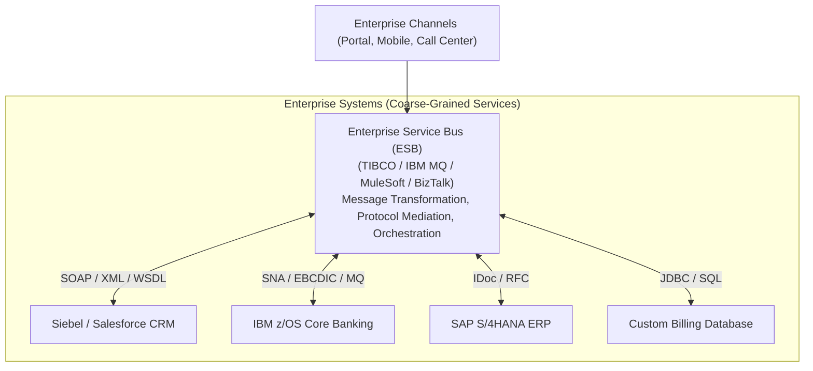

# Service-Oriented Architecture (SOA)

## Overview
**Service-Oriented Architecture (SOA)** is an enterprise architectural style that structures an IT landscape as a collection of coarse-grained, reusable enterprise business services coordinated via a centralized middleware integration backbone, historically known as an **Enterprise Service Bus (ESB)**.

## Problem It Solves
Solves the enterprise integration challenge of connecting disparate, legacy, heterogeneous enterprise systems (SAP ERP, Mainframes, Oracle CRM, Billing platforms) across a large conglomerate without building custom point-to-point spaghetti integrations.

## Context
Standard enterprise architecture deployed across Global Fortune 500 enterprises, banks, airlines, and telecommunication giants throughout the 2000s and 2010s; still powers legacy core backbones today.

## Structure
Hub-and-Spoke model centered around a heavyweight Enterprise Service Bus (ESB).

## Diagram

## Components
* **Enterprise Service Bus (ESB)**: Centralized middleware handling protocol translation (HTTP to JMS), message transformation (XML/XSLT), content-based routing, and business transaction orchestration.
* **Coarse-Grained Enterprise Services**: Reusable services shared across the entire corporation (e.g., `CustomerService`, `InvoiceService`).
* **Canonical Data Model (CDM)**: An enterprise-wide standardized XML/XSD schema that all systems map to and from.
* **Service Registry & Repository**: Centralized governance catalog tracking WSDL contracts and enterprise service endpoints.

## Communication Model
Predominantly synchronous and asynchronous messaging using **SOAP over HTTP/JMS**, XML, and WS-* standards (WS-Security, WS-ReliableMessaging).

## Data Strategy
Shared enterprise databases and federated transactions. Heavy reliance on **Two-Phase Commit (2PC / XA)** coordinated by the ESB.

## Benefits
* High service reusability across disparate enterprise lines of business.
* Shields modern frontends from the terrifying complexity of legacy COBOL/Mainframe interfaces.
* Centralized enterprise governance and compliance enforcement.

## Disadvantages
* **The "Dumb Pipes vs. Smart Pipes" Problem**: The ESB became bloated with complex business logic, transformation rules, and custom scripts, creating a massive, brittle single point of failure (SPOF).
* **The Canonical Model Trap**: Attempting to force every department in a 50,000-person corporation to agree on a single universal definition of "Customer" caused multi-year committee paralysis.
* **High Vendor Lock-in & Licensing**: Enormous multi-million-dollar software licensing fees for proprietary ESB platforms.

## When to Use
* Large-scale enterprise legacy integration environments integrating mainframes, ERPs, and legacy vendor packages.
* Regulated environments requiring strict centralized message mediation and compliance auditing.

## When NOT to Use
* Modern agile, cloud-native product teams.
* Lightweight web applications and startups.

## Scalability
* Limited horizontal scalability. Sizing and clustering proprietary ESB appliances is complex and expensive.

## Reliability
* High reliability if hardware appliances are properly paired; however, an ESB crash paralyzes the entire enterprise.

## Security
* Enforced via WS-Security, XML digital signatures, and perimeter firewalls.

## Observability
* Historically poor. Proprietary vendor dashboards; lack of modern distributed tracing.

## Operational Complexity
* Extreme. Requires specialized middleware administrators and certified integration engineers.

## Cost
* Very high. Heavy capital expenditure (CapEx) in proprietary software licenses and specialized consulting fees.

## Migration Considerations
* Modernization strategy: Decompose bloated ESB logic into lightweight microservices or an Event-Driven Architecture (Kafka) using the "Smart Endpoints, Dumb Pipes" principle.

## Trade-offs
* **Gains**: Reusability across disparate legacy systems, enterprise-wide abstraction.
* **Sacrifices**: Agility, deployment speed, modern cloud-native scalability, vendor independence.

## Related Patterns
* [Microservices](microservices.md)
* [Enterprise Integration](../../14-enterprise-integration/)
* [Event-Driven Architecture](event-driven-architecture.md)
