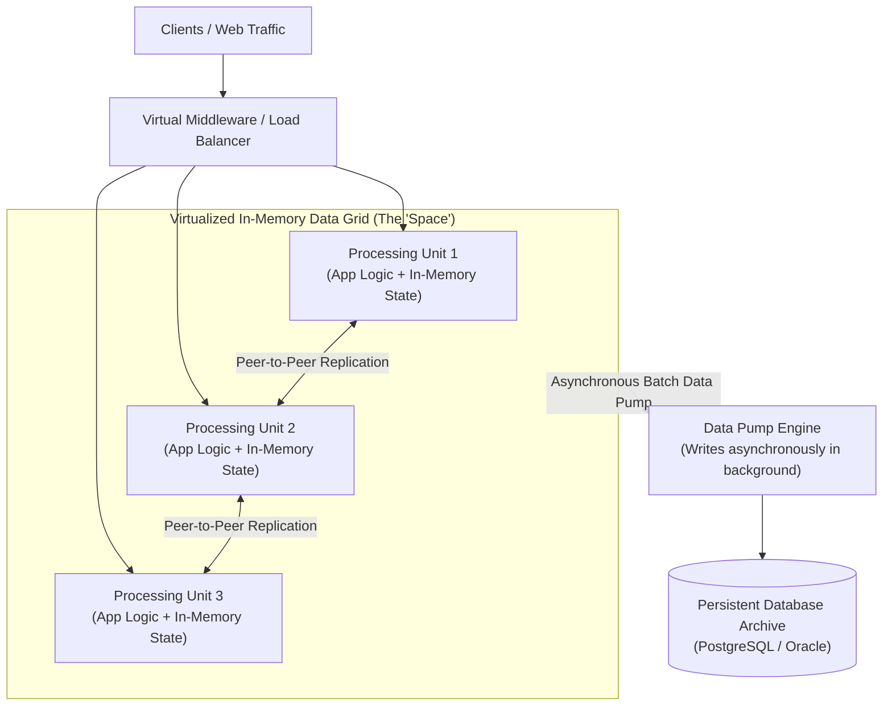

# Space-Based Architecture (Tuple Space)

## Overview
**Space-Based Architecture (SBA)** (derived from David Gelernter's Linda coordination model and Tuplespace concept) is an architectural style designed to achieve extreme high-concurrency and sub-millisecond transaction speeds by **eliminating the central database as a transactional bottleneck**, keeping all active transactional state in a shared, in-memory distributed data grid replicated across autonomous processing units.

## Problem It Solves
Solves the fundamental database concurrency wall in extreme-load systems (e.g., airline ticket reservations during flash sales, stock market trading exchanges, online gambling platforms) where the physical I/O limits of centralized SQL databases cause connection pool exhaustion and lock contention.

## Context
High-frequency trading (HFT), high-volume auction platforms, global ticket sales (Ticketmaster), and real-time multiplayer gaming.

## Structure
Processing Units (containing business logic + in-memory replicated data grid) $\to$ Virtualized Space / Middleware Coordinator $\to$ Asynchronous Data Pump $\to$ Secondary Database Archive.

## Diagram

## Components
* **Processing Unit (PU)**: Self-contained deployment unit containing business domain logic and a local in-memory data grid partition.
* **Virtual Space / Middleware**: Orchestrates dynamic deployment, clustering, and state synchronization between processing units.
* **Data Pump**: Asynchronous worker that streams in-memory transactions to a permanent database in the background.
* **Data Writer / Reader**: Handles cold-start cache warming and persistent archival.

## Communication Model
In-memory reads and writes; inter-PU synchronization via high-speed UDP multicast or peer-to-peer TCP replication.

## Data Strategy
**In-Memory Primary**: Transactions commit to RAM, not disk! Durability is achieved through in-memory replication across multiple nodes, followed by asynchronous writes to cold disk storage.

## Benefits
* **Extreme Throughput & Ultra-Low Latency**: Read and write transactions execute in **microseconds** because zero synchronous disk I/O occurs on the critical user path.
* **Elastic Scalability**: Simply boot new processing units; the distributed memory grid dynamically partitions and rebalances state across the cluster.
* **Immunity to Database Outages**: If the persistent database crashes, active user operations continue running in memory without interruption.

## Disadvantages
* **High Infrastructure Cost**: RAM is significantly more expensive than SSD disk storage.
* **Data Loss Risk**: If an entire cloud data center suffers a catastrophic power outage before the Data Pump writes memory to disk, recent in-flight transactions can be lost.
* **Extreme Architectural & Coding Complexity**: Difficult to test, debug, and reason about; requires specialized distributed grid software (Hazelcast, Apache Ignite, GigaSpaces).

## When to Use
* High-volume, unpredictable transactional spikes where traditional databases collapse (e.g., concert ticket drops, sports betting during the World Cup).
* Financial systems requiring sub-millisecond execution speeds.

## When NOT to Use
* Standard enterprise line-of-business applications with modest traffic.
* Systems where RAM cost exceeds budget envelopes.
* Systems requiring strict relational reporting and complex ad-hoc SQL joins.

## Scalability
* Near-infinite horizontal scalability for in-memory compute and read/write operations.

## Reliability
* High runtime reliability via in-memory replication; however, complex split-brain scenarios must be managed by the space coordinator.

## Security
* In-memory encryption required; cluster nodes must authenticate using mutual TLS.

## Observability
* Requires deep JVM/memory profiling tools and real-time monitoring of memory heap saturation and replication lag.

## Operational Complexity
* Very high. Demands specialized operational knowledge of distributed data grids and memory tuning.

## Cost
* High. Heavy consumption of high-memory cloud VM instances (AWS `r6i` or `x2iedn` families).

## Migration Considerations
* Typically deployed as an auxiliary high-speed layer in front of a legacy core system rather than replacing it outright.

## Trade-offs
* **Gains**: Sub-millisecond latency, massive write throughput, elimination of database bottlenecks.
* **Sacrifices**: High memory infrastructure cost, eventual durability risk, operational complexity.

## Related Patterns
* [Event-Driven Architecture](event-driven-architecture.md)
* [CQRS](../../13-architecture-patterns/cqrs/)
