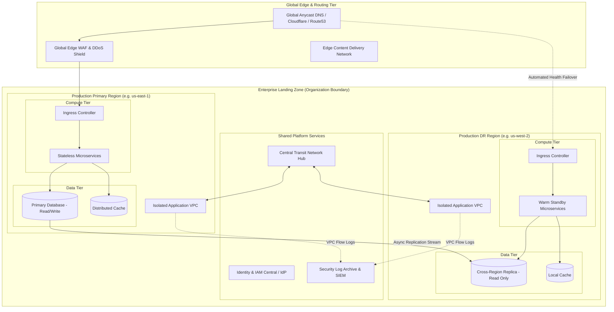

# Cloud Architecture: Workload Placement, Topology, and Platform Patterns

## 1. Architectural Overview & Context
**Cloud Architecture** governs the decomposition, placement, isolation, and networking of enterprise workloads across cloud infrastructure. 

Modern enterprise cloud architecture begins with a foundational rule:
> **Design vendor-neutral conceptual topologies first; bind to cloud-specific managed services deliberately through explicit trade-off analysis.**

```
Enterprise Business Requirements
               │
               ▼
┌─────────────────────────────────────────────────────────────┐
│             VENDOR-NEUTRAL ARCHITECTURE LAYER               │
│ Compute Abstraction │ Storage Tiering │ Network Boundaries  │
└──────────────────────────────────┬──────────────────────────┘
                                   │
             ┌─────────────────────┼─────────────────────┐
             ▼                     ▼                     ▼
      [Amazon Web Services] [Microsoft Azure] [Google Cloud Platform]
      EKS / Aurora / S3     AKS / Cosmos / Blob GKE / Spanner / GCS
```

---

## 2. Enterprise Cloud Topology Blueprint (Multi-Region / Multi-Account)



---

## 3. Workload Placement & Compute Model Decision Matrix

Choosing the right compute abstraction requires balancing operational control, developer productivity, startup latency, and unit economics:

| Architectural Dimension | Virtual Machines (IaaS) | Containers / Kubernetes (CaaS) | Serverless Functions (FaaS) | Managed Container PaaS |
|---|---|---|---|---|
| **Representative Services** | EC2, Azure VM, Compute Engine | EKS, AKS, GKE | AWS Lambda, Azure Functions, Cloud Functions | AWS ECS Fargate, Cloud Run, Azure Container Apps |
| **Startup Latency** | Minutes ($60\text{s} - 300\text{s}$) | Seconds ($2\text{s} - 15\text{s}$) | Milliseconds ($50\text{ms} - 800\text{ms}$ cold) | Seconds ($2\text{s} - 10\text{s}$) |
| **Scaling Granularity** | Coarse (per VM instance) | Moderate (per Pod via HPA/KEDA) | Ultra-fine (per request execution) | Fine (per container task) |
| **Stateful Capabilities** | Excellent (Dedicated NVMe / EBS) | Good (StatefulSets + CSI driver) | None (Stateless only) | Poor (Transient storage preferred) |
| **Operational Overhead** | High (OS patching, AMI baking) | High (Control plane, networking, CNI) | Very Low (Fully managed runtime) | Low (Zero cluster management) |
| **Ideal Architectural Fit** | Legacy COTS software, massive databases | Complex distributed microservices, service meshes | Event-driven webhooks, data pipelines, spiky traffic | Web applications, REST APIs, moderate batch tasks |

---

## 4. Multi-Region Topologies & Failover Mechanics

| Strategy | RPO | RTO | Cost Multiplier | Architecture Complexity & Risk |
|---|---|---|---|---|
| **1. Single Region (Multi-AZ)** | Zero within region | Minutes (AZ failure) | $1.0\times$ (Baseline) | Low. Relies on synchronous multi-AZ storage replication. Vulnerable to entire region blackouts. |
| **2. Pilot Light (Cross-Region)** | Seconds to Minutes | $10 - 30$ mins | $1.3\times - 1.5\times$ | Moderate. Core databases replicate asynchronously; compute resources are dormant until disaster spin-up. |
| **3. Warm Standby** | Seconds | $< 5$ mins | $1.6\times - 1.8\times$ | High. Standby region runs with minimal compute capacity; scales up on DNS health check trip. |
| **4. Active-Active (Multi-Region)**| Near-Zero | Zero | $2.2\times - 3.0\times$ | Extremely High. Requires distributed conflict resolution (CRDTs / CockroachDB / Spanner) or strict geographic user partitioning to avoid cross-region database locks. |

---

## 5. Portability vs. Managed Services (The Lock-in Trade-off)

The desire for "100% cloud portability" often degrades into an architectural anti-pattern where teams construct an expensive, buggy in-house replica of AWS or Azure on top of raw VMs.

```
Portability Purity                                               Value Maximization
┌───────────────────────────────────────┐                        ┌───────────────────────────────────────┐
│ Self-managed Postgres on VMs          │                        │ Managed RDS Aurora / Cloud SQL        │
│ Self-managed Kafka on Kubernetes      │  ────Trade-off View───►│ Managed MSK / Confluent Cloud         │
│ Self-managed HashiCorp Vault on EC2   │                        │ Managed AWS KMS / Azure Key Vault     │
│ Enormous cognitive & ops overhead     │                        │ Fast time to market, native security  │
└───────────────────────────────────────┘                        └───────────────────────────────────────┘
```

### The Architectural Prudence Rule:
1. **Adopt managed data planes** (e.g. AWS Aurora, GCP Cloud SQL) where operational toil exceeds competitive advantage.
2. **Isolate vendor SDKs** behind internal domain interfaces (hexagonal ports/adapters) so that changing vendors requires zero modifications to business domain code.
3. **Containerize applications** (OCI standards) so execution remains platform-agnostic, even if the underlying orchestration is cloud-managed.

---

## 6. Enterprise Cloud Architecture Checklist
- [ ] Implement an automated Multi-Account Landing Zone (AWS Control Tower, Azure Management Groups) separating Dev, Staging, Prod, and Audit.
- [ ] Enforce Infrastructure as Code (Terraform / OpenTofu) with state files locked in remote encrypted storage.
- [ ] Restrict all database and caching tiers to private VPC subnets with zero public internet routing.
- [ ] Route all intra-cloud communications through VPC Endpoints / PrivateLink to eliminate network egress charges.
- [ ] Enforce automated tagging policies (`CostCenter`, `Environment`, `Owner`) for FinOps cost allocation.
- [ ] Define automated RPO/RTO metrics and validate cross-region backup restoration quarterly.

---

## 7. Related Modules
* [08-cloud/](../../08-cloud/) — Cloud-native implementation patterns, serverless runtimes, and FinOps cost optimization.
* [18-reference-architectures/](../../18-reference-architectures/) — End-to-end production landing zones and global topologies.
* [02-system-design/disaster-recovery/](../../02-system-design/disaster-recovery/README.md) — Disaster recovery frameworks and business continuity math.
