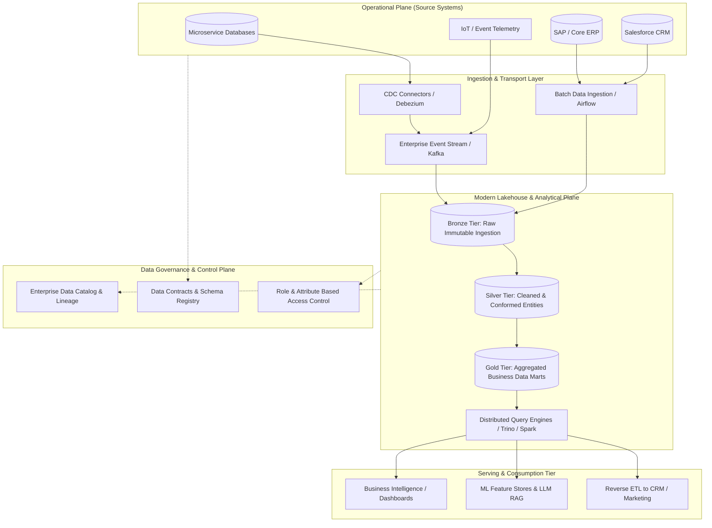

# Data Architecture: Operational Systems, Analytical Platforms, and Data Mesh

## 1. Architectural Overview & Context
**Enterprise Data Architecture** defines how an organization models, ingests, transforms, governs, and serves data across transactional operations and analytical decision-making.

A primary cause of architectural failure in modern enterprises is violating the **Dual Nature of Data**:
1. **Operational Data (OLTP)**: Optimized for single-record CRUD, low-latency concurrent transactions, strict ACID consistency, and operational execution (e.g., placing an order, verifying user authentication).
2. **Analytical Data (OLAP)**: Optimized for multi-million-row scans, complex aggregations, columnar projection, temporal analysis, and historical reporting (e.g., quarterly sales trends, churn modeling).

```
┌───────────────────────────────────────┐         ┌───────────────────────────────────────┐
│        OPERATIONAL PLANE (OLTP)       │         │        ANALYTICAL PLANE (OLAP)        │
├───────────────────────────────────────┤         ├───────────────────────────────────────┤
│ Microservice Databases (Postgres, etc)│         │ Lakehouse (Iceberg, Delta Lake)       │
│ Row-oriented storage (B-Trees)        │ ──ETL──►│ Columnar storage (Parquet / ORC)      │
│ Normalized (3NF) schemas              │   CDC   │ Dimensional (Star / Snowflake) schemas│
│ ACID guarantees, Sub-millisecond locks│         │ Eventual consistency, Multi-node MPP  │
└───────────────────────────────────────┘         └───────────────────────────────────────┘
```

---

## 2. Enterprise Data Architecture Blueprint



---

## 3. Analytical Architecture Paradigms Compared

| Architectural Pattern | Storage Format | Query Execution | Primary Advantages | Critical Trade-offs |
|---|---|---|---|---|
| **Enterprise Data Warehouse (EDW)** | Proprietary Columnar (Snowflake, BigQuery) | Native MPP cluster | Extreme SQL query performance; turn-key security & governance | High storage/compute cost; proprietary vendor lock-in |
| **Data Lake (Gen 1)** | Raw Files (JSON, CSV on S3/HDFS) | External compute (Hive, Presto) | Inexpensive object storage; accepts any unstructured format | "Data swamp" risk; lack of ACID guarantees; poor metadata |
| **Lakehouse (Modern Standard)** | Open Table Formats (Apache Iceberg, Delta Lake) | Decoupled engines (Trino, Spark, DuckDB) | ACID transactions on object storage; time-travel; zero engine lock-in | Operational complexity of compaction, partitioning, and vacuuming |
| **Data Mesh** | Decentralized domain data products | Federated query plane | Eliminates central data engineering bottlenecks; aligns to business domains | Requires high engineering maturity and decentralized organizational governance |

---

## 4. The Data Mesh Paradigm: Data as a Product

Data Mesh shifts data ownership from a centralized, monolithic data engineering team to cross-functional **domain squads**.

### The 4 Core Principles of Data Mesh:
1. **Domain Ownership**: The Order Service team owns the *Order Analytical Data Product*, including its schema, quality, and lifecycle.
2. **Data as a Product**: Analytical data is packaged with documentation, SLOs, versioned APIs, and discoverability metadata.
3. **Self-Serve Data Platform**: Platform engineering provides automated infrastructure (storage buckets, compute clusters, access control) so domain squads do not manage raw VMs.
4. **Federated Computational Governance**: Universal security policies (PII masking, retention schedules) are automated as code across all domain nodes.

### Schema Enforcement via Data Contracts
A **Data Contract** establishes an explicit, legally binding agreement between data producers and consumers:
```yaml
# order_created_v2.contract.yaml
contractVersion: "2.1.0"
domain: "checkout"
dataset: "order_events"
sla:
  latency: "99% of events delivered < 5000ms"
  uptime: "99.95%"
schema:
  type: record
  fields:
    - name: order_id
      type: string
      format: uuid
    - name: customer_id
      type: string
    - name: total_amount_cents
      type: long
      minimum: 0
    - name: created_at_utc
      type: string
      format: date-time
```

---

## 5. Master Data Management (MDM) & Entity Golden Records

When customer entities exist across Salesforce, SAP, and custom billing services, the enterprise data architecture must establish a **Golden Record**:
* **Identity Resolution**: Matching records via deterministic matching (Tax ID, verified email) and probabilistic algorithms (Levenshtein distance on customer name/address).
* **Survivorship Rules**: Defining source-of-truth precedence (e.g., Salesforce owns `billing_address`; SAP owns `credit_limit`; IAM owns `email_address`).

---

## 6. Enterprise Data Architecture Checklist
- [ ] Explicitly decouple operational transactional databases from analytical query workloads.
- [ ] Enforce open table formats (Apache Iceberg or Delta Lake) on object storage to prevent analytical storage lock-in.
- [ ] Mandate formal Data Contracts with backward-compatibility linting in CI/CD pipelines.
- [ ] Implement automated end-to-end data lineage tracking (OpenLineage) from source database to BI report.
- [ ] Enforce automated column-level PII masking and row-level filtering based on user role.
- [ ] Schedule automated vacuuming, file compaction, and snapshot expiration on data lakehouse tables.

---

## 7. Related Modules
* [06-data/](../../06-data/) — Low-level data storage, distributed caching, search engines, and data lakes.
* [12-ai/](../../12-ai/) — AI data pipelines, vector databases, and feature stores.
* [23-enterprise-architecture/](../../23-enterprise-architecture/) — Strategic data governance and corporate information architecture.
