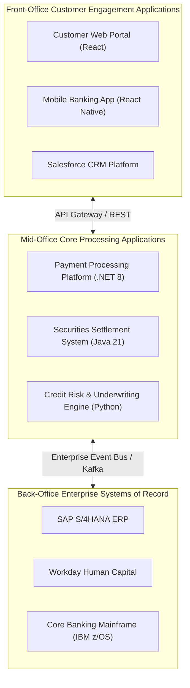
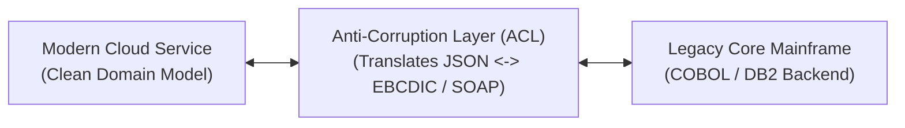

# Enterprise Application Architecture & Portfolio Boundaries

> **Domain**: `01-architecture/enterprise-architecture`  
> **Status**: Approved  
> **Target Audience**: Enterprise Architects, Solution Architects, Application Leaders

---

## 1. Simple Explanation

**Enterprise Application Architecture** maps the complete landscape of software applications across an enterprise, defining the structural boundaries between systems, eliminating redundant duplicate applications, and ensuring seamless interoperability across business units.

---

## 2. The Enterprise Application Landscape

In a global MNC with 50,000 employees, the IT application portfolio typically contains between 500 and 3,000 distinct software applications:

---

## 3. Application Boundary Identification via Domain-Driven Design (DDD)

A major failure in enterprise application architecture is creating overlapping applications that compete for the same business capability (e.g., three different business units build their own custom "Customer Master" database).

### Applying Strategic DDD Bounded Contexts at Enterprise Scale
* **Bounded Contexts**: Define clear semantic boundaries. In the `Sales Context`, a customer is a "Lead" or "Prospect". In the `Billing Context`, a customer is a "Billing Account". In the `Shipping Context`, a customer is a "Delivery Recipient".
* **Anti-Corruption Layer (ACL)**: When a modern cloud microservice must communicate with a 30-year-old monolithic mainframe, never allow legacy COBOL data formats to leak into modern domain models. Place an Anti-Corruption Layer between them to translate protocols and data schemas cleanly.

---

## 4. Application Interoperability Standards

To prevent an enterprise application landscape from devolving into an unmanageable web of custom point-to-point connections:
1. **Paved Ingress Paths**: All incoming B2B partner and client traffic must terminate on standardized Enterprise API Gateways.
2. **Event Backbone Standard**: Cross-application state dissemination must publish CloudEvents to the central enterprise event broker (Kafka). Direct cross-application database querying is strictly forbidden.
3. **Canonical Interface Registry**: All published application APIs must register versioned OpenAPI or Protobuf specifications in the central enterprise developer catalog (Backstage).
