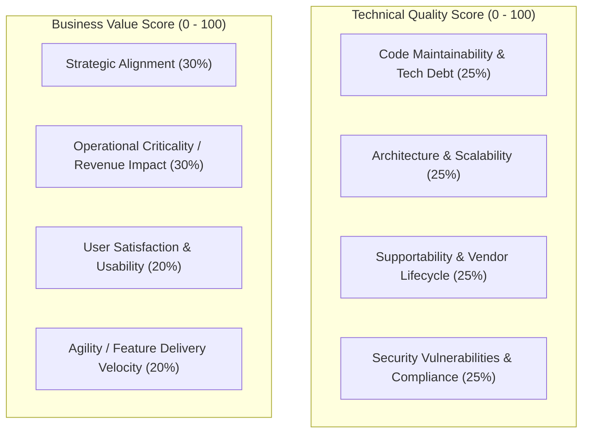
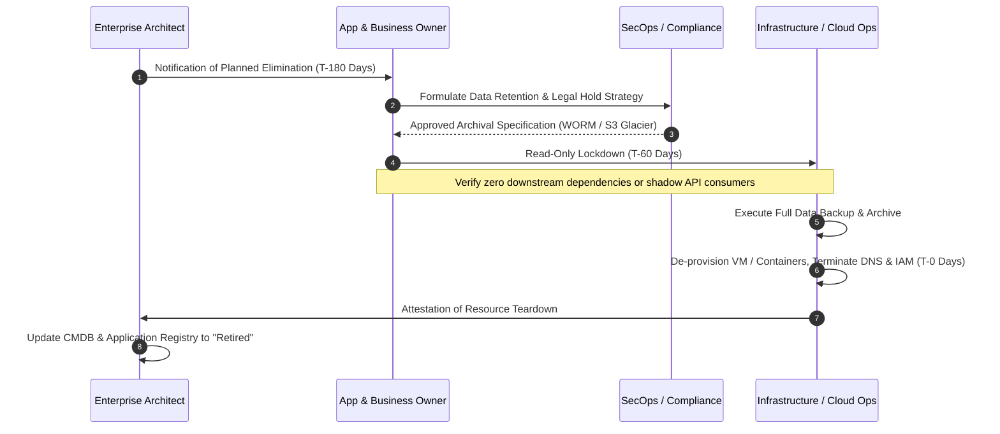

# Application Portfolio Management (APM)

## Overview

Application Portfolio Management (APM) is an enterprise architecture governance practice that catalogs, evaluates, scores, and governs an organization's complete software application estate. In Global 2000 and Fortune 500 enterprises, application estates frequently encompass 500 to 5,000+ distinct systems across disparate business units, geographies, and acquisition histories. Without disciplined APM, enterprise estates experience rampant redundancy, mounting technical debt, unbounded license expenditures, and severe operational vulnerability.

APM provides the factual baseline for IT rationalization, cloud modernization roadmaps, compliance reporting, and strategic capital allocation.

---

## The APM Lifecycle

```mermaid
flowchart LR
    subgraph Discovery["1. Discovery & Inventory"]
        D1[CMDB / Service Catalogs]
        D2[Network Discovery]
        D3[Procurement & SaaS Spend]
    end

    subgraph Assessment["2. Multi-Dimensional Assessment"]
        A1[Business Value]
        A2[Technical Health]
        A3[Cost & Total TCO]
        A4[Risk & Compliance]
    end

    subgraph Rationalization["3. Rationalization (TIME Model)"]
        T1[Tolerate]
        T2[Invest]
        T3[Migrate / Replace]
        T4[Eliminate / Retire]
    end

    subgraph Roadmap["4. Execution Roadmap"]
        R1[Modernization Waves]
        R2[Decommissioning Pipelines]
        R3[Target State Reference]
    end

    Discovery --> Assessment --> Rationalization --> Roadmap
    Roadmap -.->|Feedback Loop| Discovery
```



---

## Core Metadata Schema for Enterprise Applications

Every application in the enterprise catalog must maintain a standardized record:

| Attribute Group | Attributes Captured | Purpose / Value |
|:---|:---|:---|
| **Identity & Ownership** | Application ID, Name, Business Owner, Technical Owner, SRE Lead, Cost Center | Accountability, incident escalation, budgetary assignment |
| **Business Context** | Business Capability Mapped (L1-L3), Criticality Tier (Tier 0 to Tier 3), User Count, Geographies | Business alignment, disaster recovery priority |
| **Technical Stack** | Primary Language/Runtime, Database, Hosting Model (On-Prem, IaaS, PaaS, SaaS), Integration Interfaces | Technology lifecycle risk, modernization grouping |
| **Operational Health** | MTTR, Incident Frequency (P1/P2 per quarter), SLA/SLO Attainment, Patch Status | Operational stability scoring |
| **Financial Profile** | Annual Run Cost, Licensing Model, Maintenance Contracts, Infrastructure Hosting Cost | TCO rationalization, ROI analysis |
| **Risk & Compliance** | Data Classification (PII, PCI, HIPAA, Public), SBOM Availability, Regulatory Scopes | Audit readiness, zero-day blast radius assessment |

---

## The Gartner TIME Rationalization Framework

The TIME framework categorizes applications along two orthogonal axes: **Technical Quality / Fitness** (x-axis) and **Business Value / Fit** (y-axis).

```
   High ^
        |
        |   TOLERATE                  INVEST
        |   - High Business Value     - High Business Value
        |   - Low Technical Quality   - High Technical Quality
        |   Action: Encapsulate,      Action: Expand, Modernize,
        |   refactor, or contain      scale, fund innovation
B       |
U       |--------------------------------------------------
S       |
I       |   ELIMINATE                 MIGRATE
N       |   - Low Business Value      - Low Business Value
E       |   - Low Technical Quality   - High Technical Quality
S       |   Action: Decommission,     Action: Standardize, Replace
S       |   terminate licenses        with SaaS, or consolidate
        |
        +-------------------------------------------------->
        Low                 TECHNICAL QUALITY               High
```

### Strategic Action Profiles

#### 1. Invest (High Business Value, High Technical Quality)
- **Profile**: Modern, cloud-native or well-factored systems directly driving competitive differentiation or core revenue.
- **Architectural Action**: Expand capabilities, implement micro-frontends or event streaming, allocate strategic engineering capital, and integrate with advanced analytics/AI.

#### 2. Tolerate (High Business Value, Low Technical Quality)
- **Profile**: Legacy mission-critical applications (e.g., COBOL core banking, 20-year-old monolithic ERP) that deliver essential business outcomes but suffer from brittle code, obsolete runtimes, or scarce engineering talent.
- **Architectural Action**: Wrap with modern API facades (Strangler Fig pattern), quarantine behind zero-trust network boundaries, containerize where feasible, avoid heavy internal modifications, and prepare incremental strangulation plans.

#### 3. Migrate / Replace (Low Business Value, High Technical Quality)
- **Profile**: Well-built custom applications performing non-differentiating utility functions (e.g., custom-coded employee travel expense tool or internal messaging board).
- **Architectural Action**: Replace with off-the-shelf SaaS solutions (e.g., Workday, ServiceNow, Slack), redirecting bespoke engineering talent toward revenue-generating systems.

#### 4. Eliminate (Low Business Value, Low Technical Quality)
- **Profile**: Redundant, obsolete systems, zombie applications running for a handful of legacy users, duplicate tools acquired via mergers.
- **Architectural Action**: Systematic decommissioning. Execute data archiving, revoke access, terminate infrastructure subscriptions, and recover software licenses.

---

## Evaluation Scoring Model

To avoid subjective political disputes, scoring must rely on an objective, weighted multi-criteria matrix:



$$\text{Final Quadrant} = f(\text{Technical Score}, \text{Business Score})$$

---

## Decommissioning Pipeline

Retiring an enterprise application requires a rigorous, multi-stage governance pipeline:



---

## Key Metrics & KPIs

1. **Portfolio Rationalization Rate**: Percentage of applications retired or consolidated year-over-year (target: 5–10% gross reduction in technical sprawl).
2. **Duplicate Capability Density**: Number of distinct software applications mapped to the exact same Level 3 Business Capability (target: 1 single strategic platform per capability).
3. **Legacy Liability Ratio**: Ratio of systems running on unsupported OS/database/runtime platforms to total applications (target: < 2%).
4. **Cloud Migration Index**: Percentage of portfolio workloads hosted on cloud-native or managed PaaS platforms.
