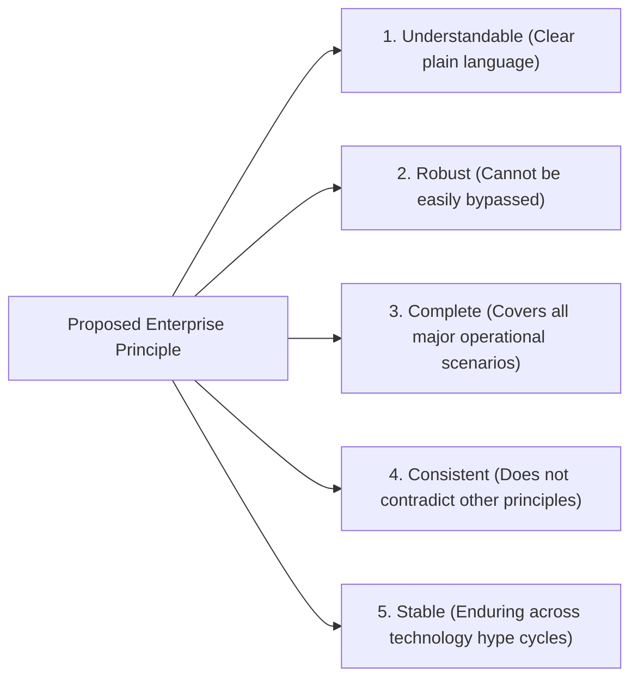

# Enterprise Architecture Principles: Framework & Lifecycle

> **Domain**: `01-architecture/enterprise-architecture`  
> **Status**: Approved  
> **Target Audience**: Enterprise Architects, Chief Technology Officers, ARB Members

---

## 1. Context & Purpose

Enterprise Architecture Principles serve as the constitutional law of an organization's IT landscape. While tactical technologies change rapidly, architectural principles remain stable for 5 to 10 years, providing immutable guidance for thousands of daily engineering decisions across hundreds of distributed squads.

---

## 2. Principle Formulation Framework

To ensure enterprise principles are actionable and defensible, every principle formulated by the Enterprise Architecture practice must satisfy the **TOGAF 5-Criteria Quality Gate**:



---

## 3. The 4-Part Principle Template

Every enterprise principle in this handbook follows the canonical TOGAF structure:

1. **Name / Statement**: A memorable, declarative axiom (e.g., *"Security by Design"* or *"Avoid Unnecessary Distributed Systems"*).
2. **Rationale**: The financial, operational, or business justification explaining why the enterprise adopted this rule.
3. **Implications**: The tangible, often difficult trade-offs required by engineering squads, infrastructure teams, and management to uphold the principle.
4. **Violations / Anti-Patterns**: Explicit examples of non-compliant behavior that will be flagged and rejected by the Architecture Review Board.

---

## 4. The Enterprise Principles Hierarchy

```text
┌─────────────────────────────────────────────────────────────┐
│                 ENTERPRISE PRINCIPLES HIERARCHY             │
├─────────────────────────────────────────────────────────────┤
│ 1. Enterprise Business Principles                           │
│    (e.g., Customer Trust First; Cloud-First Economic Model) │
│                             ↓                               │
│ 2. Core Architecture Principles (The Invariants)            │
│    (The 15 Principles codified in ARCHITECTURE-PRINCIPLES)  │
│                             ↓                               │
│ 3. Domain & Platform Architectural Standards                │
│    (e.g., Payments Domain: Immutable Append-Only Ledgers)   │
│                             ↓                               │
│ 4. Implementation Guidelines & Linter Rules                 │
│    (e.g., ESLint, SonarQube, ArchUnit CI test rules)        │
└─────────────────────────────────────────────────────────────┘
```

---

## 5. Master Reference

For the comprehensive specification of the 15 enterprise architectural principles governing all solution designs in this handbook, consult:  
👉 [The 15 Enterprise Architecture Principles](../../ARCHITECTURE-PRINCIPLES.md)
