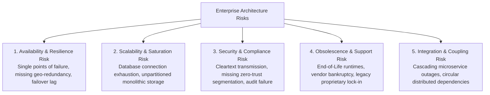
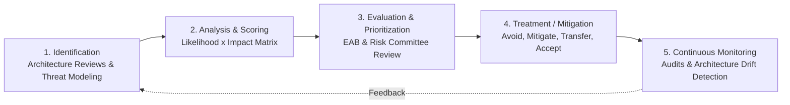

# Architecture Risk Management

## Overview

Architecture Risk Management is the proactive enterprise practice of identifying, analyzing, quantifying, and mitigating architectural risks across an organization's systems portfolio. An architectural risk is a structural design deficiency, technological dependency, or organizational misalignment that threatens an enterprise's operational continuity, data integrity, regulatory standing, or financial health.

Unlike transient runtime incidents, architectural risks represent deep structural vulnerabilities embedded in system topology, data flows, integration couplings, and infrastructure designs.

---

## Architecture Risk Taxonomy



---

## The Risk Assessment Process

Architecture risk evaluation aligns with the ISO 31000 / NIST SP 800-30 framework:



---

## The 5x5 Enterprise Risk Scoring Matrix

Every identified architectural risk is scored using a 5x5 matrix evaluating **Likelihood of Failure** vs. **Business Blast Radius Impact**:

$$\text{Risk Score} = \text{Likelihood (1–5)} \times \text{Impact (1–5)}$$

```
          Impact ->
 Likelihood   1: Minor    2: Moderate    3: Significant    4: Major       5: Catastrophic
     |      +-----------+--------------+-----------------+--------------+----------------+
 5: Almost  | Medium (5)| High (10)    | High (15)       | Critical(20) | Critical (25)  |
    Certain |           |              |                 |              |                |
 4: Likely  | Low (4)   | Medium (8)   | High (12)       | Critical(16) | Critical (20)  |
 3: Possible| Low (3)   | Medium (6)   | Medium (9)      | High (12)    | High (15)      |
 2: Unlikely| Low (2)   | Low (4)      | Medium (6)      | Medium (8)   | High (10)      |
 1: Rare    | Low (1)   | Low (2)      | Low (3)         | Low (4)      | Medium (5)     |
            +-----------+--------------+-----------------+--------------+----------------+
```

### Treatment Protocols by Severity
- **Critical (16–25)**: Immediate escalation to CIO/CTO. Mandated architectural redesign or remediation project funded within the current quarter. Deployment freezes enforced if compliance or life safety is at risk.
- **High (10–15)**: Remediation plan required within 60 days. Formal review by Enterprise Architecture Board (EAB).
- **Medium (5–9)**: Tracked on the Architecture Risk Register. Scheduled for resolution in subsequent product releases or modernization waves.
- **Low (1–4)**: Documented and accepted as operational reality. Monitored periodically.

---

## Architectural Treatment Strategies

Enterprise Architects respond to risk through four classic strategies:

| Strategy | Architectural Meaning | Concrete Real-World Example |
|:---|:---|:---|
| **Mitigate** | Redesign the system topology to reduce likelihood or impact. | Implement multi-region active-active deployment with circuit breakers to eliminate single-region outage risk. |
| **Avoid** | Eliminate the risky component or requirement entirely. | Discontinue custom-built cryptography algorithms; standardize on AWS KMS / HashiCorp Vault. |
| **Transfer** | Shift financial/operational liability to a specialized third party. | Migrate self-managed Kubernetes clusters on EC2 to AWS EKS with enterprise SLAs; purchase cyber insurance. |
| **Accept** | Consciously accept the risk when cost of mitigation exceeds potential loss. | Accept a 10-minute reporting downtime during overnight batch re-indexing; sign formal waiver with business owner. |

---

## The Enterprise Architecture Risk Register

All architectural risks must be formally maintained in the enterprise risk repository:

```markdown
### [AR-SEC-019] Unencrypted Cross-Data-Center Legacy RPC Calls
- **Category**: Security & Regulatory Compliance
- **Affected Systems**: Customer Account Master (Service ID: CAM-102) & Fraud Detection Engine (FDE-304)
- **Likelihood**: 4 (Frequent automated lateral probes)
- **Impact**: 5 (Substantial regulatory fine under GDPR Art 32 / PCI DSS 4.0 violation)
- **Composite Risk Score**: 20 (Critical)
- **Root Cause**: Custom RPC protocol developed in 2012 over plain TCP sockets without TLS encapsulation.
- **Recommended Treatment**: Mitigate
- **Architectural Action Plan**: Deploy Envoy service mesh sidecars across all communicating nodes to enforce mTLS (Mutual TLS) with zero changes to application code.
- **Assigned Owner**: Enterprise Security Architect (Jane Doe) & Principal Engineer (John Smith)
- **Target Resolution**: 2026-Q4 Release Train
- **Status**: Under Remediation
```
