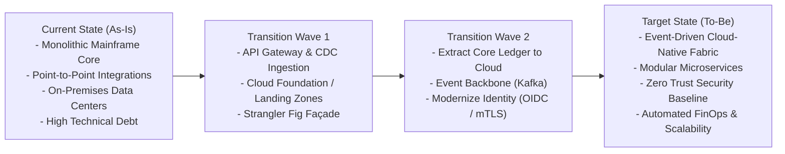

# Architecture Roadmaps: Current State, Target State & Transition Waves

> **Domain**: `01-architecture/enterprise-architecture`  
> **Status**: Approved  
> **Target Audience**: Enterprise Architects, Strategic Planners, CIOs, CTOs

---

## 1. Simple Explanation

An **Architecture Roadmap** is a strategic multi-year navigation plan that charts the path from an enterprise's messy, technical-debt-laden **Current State (As-Is)** to a modernized, resilient, cost-optimized **Target State (To-Be)** through a sequence of risk-managed, value-delivering **Transition States (Waves)**.

---

## 2. The Current State $\to$ Transition Waves $\to$ Target State Model

Enterprise systems cannot be transformed in a risky, "Big Bang" overnight cutover. Transformations must be staged in discrete architectural waves:



---

## 3. Designing Transition Waves (The "Tracer Bullet" Philosophy)

A fatal flaw in historical IT roadmaps was spending 18 months building "underlying infrastructure" without delivering any visible business features. When budgets tightened, executive leadership cancelled the program as an expensive failure.

### The Modern Solution: Value-Driven Vertical Slicing
* **Every Transition Wave Must Deliver Concrete Business Value**:
  * *Bad Wave 1*: "Set up Kubernetes and Terraform modules" (Zero business value visible to the CEO).
  * *Good Wave 1*: "Migrate the Customer Onboarding Journey to cloud-native microservices; cuts onboarding time from 3 days to 5 minutes while establishing our cloud foundation."
* **Tracer Bullets**: Build an end-to-end thin vertical slice through all architectural tiers (Frontend $\to$ Gateway $\to$ Service $\to$ Database $\to$ CI/CD $\to$ Monitoring) to prove architectural assumptions in production early.

---

## 4. Roadmapping Horizons (The 70-20-10 Model)

Enterprise Architects structure technology investments across three time horizons:

```text
┌─────────────────────────────────────────────────────────────┐
│                 THE 3 ARCHITECTURAL HORIZONS                │
├───────────────────────────────┬─────────────────────────────┤
│ Horizon 1: Now (Next 6-12 Mo) │ 70% of engineering spend.   │
│ Core Platform Delivery        │ Active delivery of approved │
│                               │ solution architectures.     │
├───────────────────────────────┼─────────────────────────────┤
│ Horizon 2: Next (12-24 Months)│ 20% of engineering spend.   │
│ Emerging Scaling & Modernize  │ Prototyping transition waves│
│                               │ (e.g., Event Sourcing / DB) │
├───────────────────────────────┼─────────────────────────────┤
│ Horizon 3: Future (2-5 Years) │ 10% of engineering spend.   │
│ Disruptive Exploration        │ Research in 99-experiments  │
│                               │ (e.g., GenAI Agents, Wasm). │
└───────────────────────────────┴─────────────────────────────┘
```
