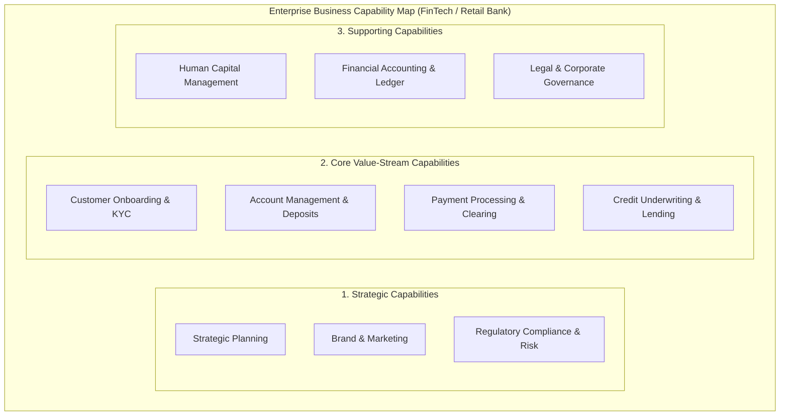
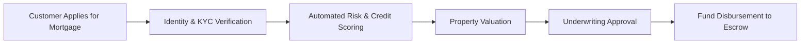

# Business Architecture: Capabilities, Value Streams & Operating Models

> **Domain**: `01-architecture/enterprise-architecture`  
> **Status**: Approved  
> **Target Audience**: Enterprise Architects, Business Strategists, Product Leaders

---

## 1. Simple Explanation

**Business Architecture** represents the foundational blueprint of the enterprise. It articulates *what* a company does, *how* it creates value for customers, and *how* it organizes its people and operational processes, completely independent of the underlying software or IT systems used to execute those functions.

---

## 2. Business Capabilities & The Capability Map

A **Business Capability** describes *what* a business does to generate value, not *how* it does it.
* A capability is stable and invariant over decades (e.g., A bank has had the capability "Process Loan Application" for 200 years; 100 years ago it was executed with paper ledgers; today it is executed with AI algorithms).

### Anatomy of an Enterprise Business Capability Map



---

## 3. Value Streams & Capability Heatmapping

A **Value Stream** depicts the end-to-end journey an enterprise undertakes to deliver a tangible outcome to an internal or external stakeholder:



### Capability Heatmapping in Strategic Planning
Enterprise Architects evaluate capabilities across two dimensions: **Strategic Importance** and **Current IT Maturity**:
* **Differentiating Capabilities**: Capabilities that create competitive advantage (e.g., Real-time AI fraud detection). **Strategy: Invest heavily in proprietary custom software.**
* **Commodity Capabilities**: Standard utilities (e.g., Payroll, Employee Expense Management). **Strategy: Outsource to SaaS (Workday/Concur). Never build custom software for commodity capabilities!**

---

## 4. Connecting Business Architecture to IT Systems

Business Architecture bridges the chasm between C-suite strategy and software implementation:

```text
┌─────────────────────────────────────────────────────────────┐
│                 STRATEGY TO CODE TRACEABILITY               │
├─────────────────────────────────────────────────────────────┤
│ 1. Business Strategy: Increase EU digital payment volume 30%│
│                             ↓                               │
│ 2. Impacted Capability: Real-Time Payment Clearing          │
│                             ↓                               │
│ 3. Solution Architecture: Event-Driven Kafka + CockroachDB  │
│                             ↓                               │
│ 4. Engineering Squad: Payments & Settlement Squad           │
│                             ↓                               │
│ 5. Codebase: /services/payment-settlement-engine            │
└─────────────────────────────────────────────────────────────┘
```
