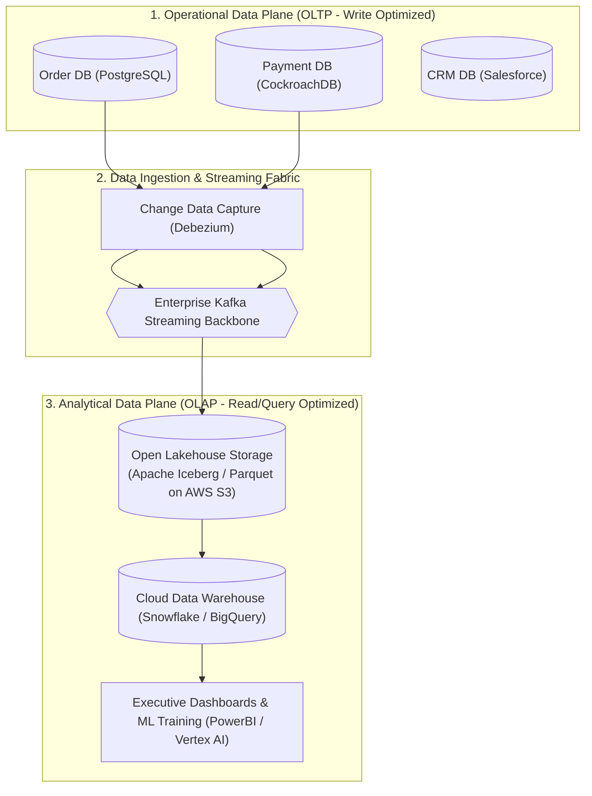

# Enterprise Data Architecture: Governance, Lineage & Topologies

> **Domain**: `01-architecture/enterprise-architecture`  
> **Status**: Approved  
> **Target Audience**: Enterprise Data Architects, Chief Data Officers (CDO), Solution Architects

---

## 1. Simple Explanation

**Enterprise Data Architecture** defines how data is acquired, governed, stored, transformed, and consumed across an entire organization, ensuring data consistency, regulatory compliance (GDPR, BCBS 239), and operational access from operational OLTP databases down to analytical data lakehouses.

---

## 2. Operational vs. Analytical Data Topologies

Enterprise data architectures must strictly decouple **Operational Data** (serving live transactions) from **Analytical Data** (serving BI reports, machine learning, and executive dashboards):



---

## 3. The 4 Modern Enterprise Data Paradigms

```text
┌─────────────────────────────────────────────────────────────┐
│                 ENTERPRISE DATA PARADIGMS                   │
├───────────────────┬─────────────────────────────────────────┤
│ 1. Data Warehouse │ Centralized, highly structured SQL      │
│    (Inmon / Kimball)│ schema. Optimized for historic BI.     │
├───────────────────┼─────────────────────────────────────────┤
│ 2. Data Lake      │ Centralized object store (S3). Stores   │
│    (Hadoop / S3)  │ raw structured, semi-structured, and    │
│                   │ unstructured files. Risk: "Data Swamp". │
├───────────────────┼─────────────────────────────────────────┤
│ 3. Lakehouse      │ Combines ACID transactions & metadata   │
│    (Iceberg/Delta)│ of warehouses with cheap S3 storage.    │
├───────────────────┼─────────────────────────────────────────┤
│ 4. Data Mesh      │ Decentralized domain data ownership.    │
│    (Zhamak Dehghani)│ "Data as a Product" served by squads. │
└───────────────────┴─────────────────────────────────────────┘
```

---

## 4. Master Data Management (MDM) & Golden Records

In large conglomerates, customer data is fragmented across 20 distinct systems (e.g., Salesforce has "John Smith, NYC", SAP has "J. Smith, New York", and Core Banking has "John A. Smith, NY").

### The Master Data Management (MDM) Architecture
* **The Golden Record**: MDM engines (Informatica, Reltio) ingest customer records from all source systems, execute deduplication, entity resolution, and survivorship rules, and publish an authoritative **Golden Customer Record**.
* The Golden Customer ID is synced back to downstream operational systems to maintain referential integrity across the enterprise.

---

## 5. Data Governance, Lineage & Compliance

Enterprise data architectures are governed by strict statutory mandates:
* **Data Lineage**: Tracking data provenance from its exact origin field in an operational database, through every ETL transformation, to its final cell on a financial regulatory report.
* **Cryptographic Erasure & GDPR Article 17**: Enforcing the "Right to be Forgotten" across distributed operational stores, analytical lakes, and immutable backups.
* **Data Classification**: Automated tagging of fields as `Public`, `Internal`, `Confidential`, or `Restricted-PII`.
