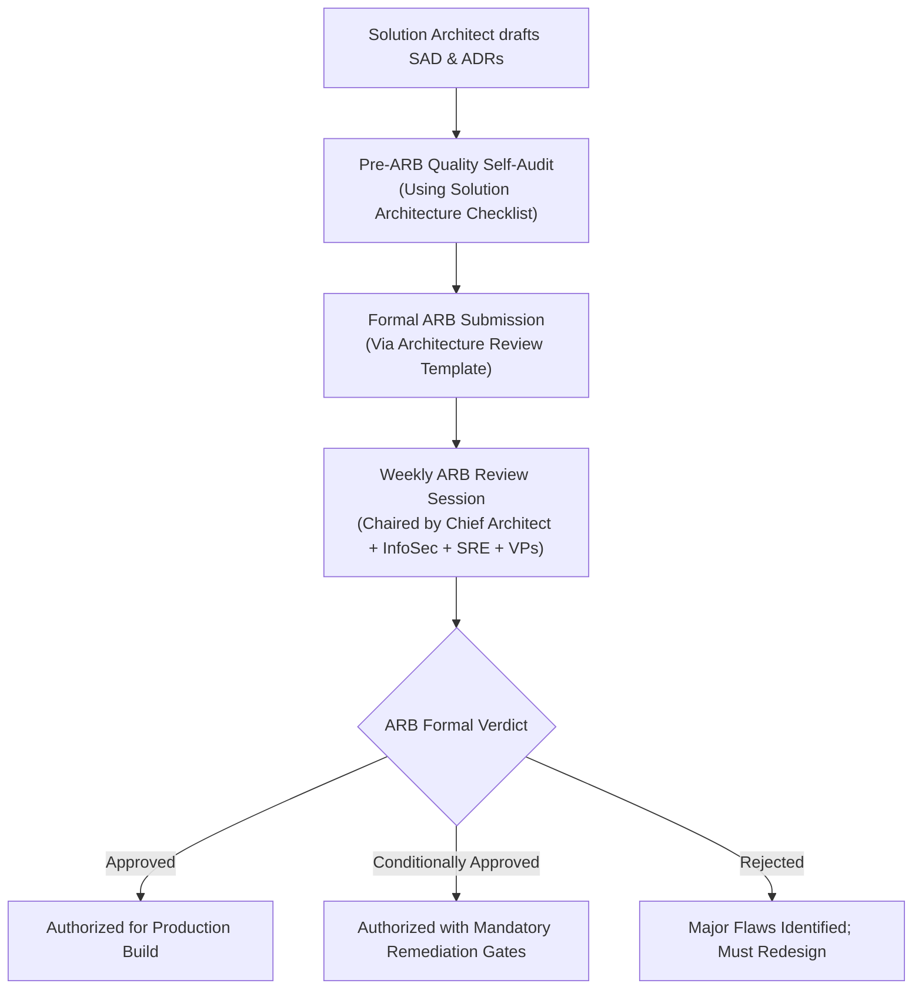

# Enterprise Architecture Governance: ARBs, Guardrails & Policy Enforcement

> **Domain**: `01-architecture/enterprise-architecture`  
> **Status**: Approved  
> **Target Audience**: Enterprise Architects, Solution Architects, IT Governance Committees

---

## 1. Simple Explanation

**Enterprise Architecture Governance** is the structured decision-making, oversight, and control framework that ensures multi-million-dollar technology investments across an enterprise align with corporate business strategy, adhere to security and legal regulations, avoid redundant duplicate software, and manage long-term technical debt.

---

## 2. The Architecture Review Board (ARB) Operating Model

The **Architecture Review Board (ARB)** is the authoritative executive governance committee responsible for evaluating, challenging, and approving major technical designs across the enterprise.



---

## 3. The ARB Evaluation Taxonomy

The ARB reviews every solution design against five core governance pillars:
1. **Business & Financial Justification**: Does the solution deliver demonstrable ROI? Has a 3-year Total Cost of Ownership (FinOps) model been validated?
2. **Architecture Principles Compliance**: Does the design adhere to the [15 Enterprise Architecture Principles](../../ARCHITECTURE-PRINCIPLES.md)?
3. **Security & Zero Trust**: Has a formal STRIDE threat model been conducted? Are credentials dynamically managed?
4. **Resiliency & Disaster Recovery**: Are RPO and RTO metrics mathematically validated? Has multi-AZ failover been designed?
5. **Technology Standards & Radar**: Are all components within the `ADOPT` or `TRIAL` rings of the [Technology Radar](../../TECHNOLOGY-RADAR.md)?

---

## 4. Modern Agile Governance: Gates vs. Guardrails

The primary failure mode of historical architecture governance was **Gatekeeper Friction**: forcing developers to wait 6 weeks for an ARB committee meeting to approve a minor database index or schema change.

```text
┌─────────────────────────────────────────────────────────────┐
│                 GATEKEEPERS VS. GUARDRAILS                  │
├───────────────────┬─────────────────────────────────────────┤
│ GATEKEEPER MODEL  │ GUARDRAIL MODEL                         │
│ (Legacy Antipattern)│ (Modern High-Velocity Standard)       │
├───────────────────┼─────────────────────────────────────────┤
│ Heavy committees. │ Automated CI/CD policy enforcement.     │
│ Manual approvals. │ Paved roads & Golden Paths (Backstage). │
│ Blocks delivery.  │ Developer self-service within policies. │
│ Reviews everything│ Reviews ONLY Type 1 (One-Way Door)      │
│ indiscriminately. │ architectural decisions.                │
└───────────────────┴─────────────────────────────────────────┘
```

### The 80/20 Governance Rule
* **Type 2 Decisions (Reversible)**: Squads make autonomously without ARB intervention (e.g., adding an internal caching layer, swapping a serialization library, refactoring internal classes).
* **Type 1 Decisions (Irreversible)**: Formally reviewed by the ARB (e.g., introducing a new database engine, altering inter-service auth protocols, changing regional data boundaries, selecting major enterprise vendor software).
