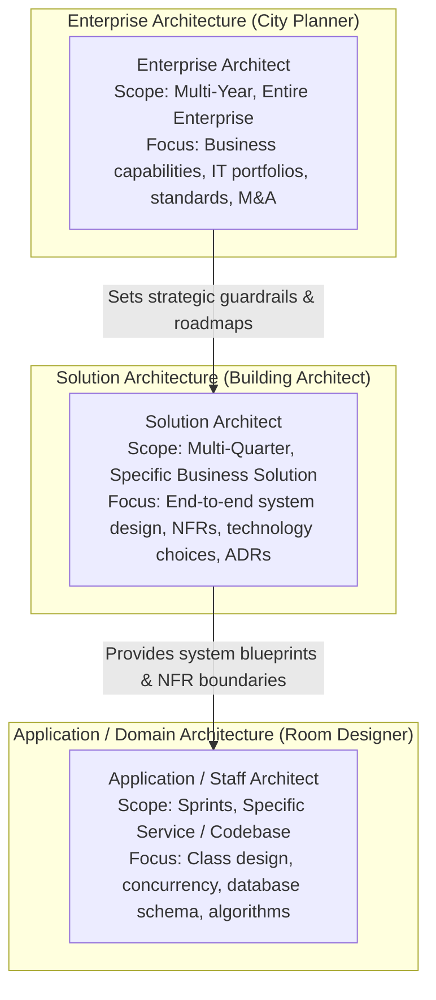
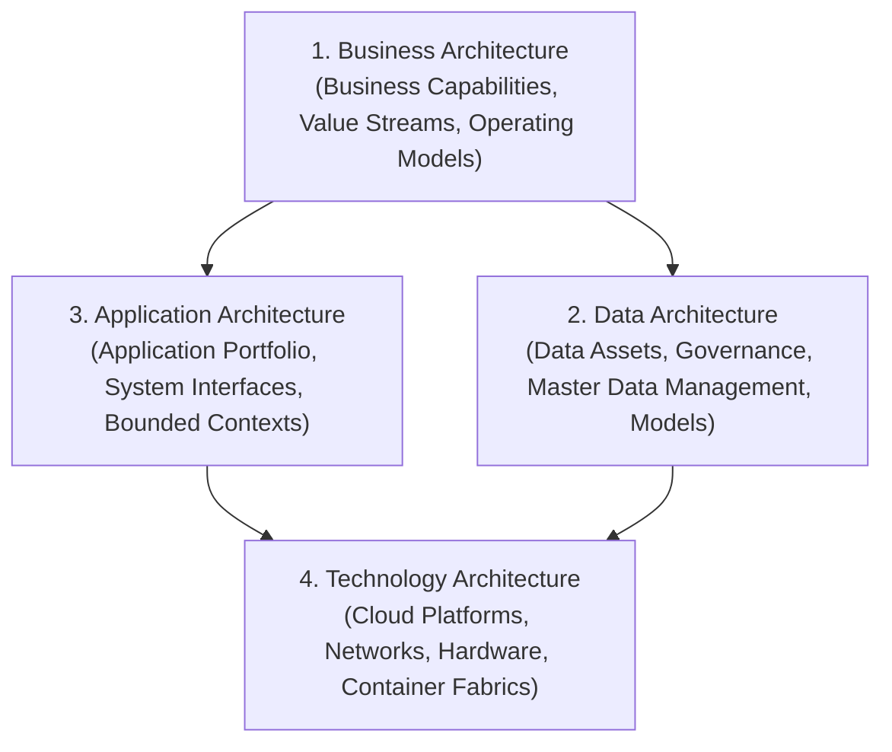

# Enterprise Architecture Overview: Scope, Disciplines & Roles

> **Domain**: `01-architecture/enterprise-architecture`  
> **Status**: Approved  
> **Target Audience**: Enterprise Architects, Solution Architects, CTOs, CIOs

---

## 1. Simple Explanation

If a **Software Engineer** writes the code for a specific room, and a **Solution Architect** designs the structural blueprint for a specific building, the **Enterprise Architect (EA)** is the chief city planner who designs the zoning laws, transportation networks, electrical grids, and multi-decade master development plans for the entire metropolis.

---

## 2. Enterprise Architecture vs. Solution Architecture vs. Application Architecture

Understanding the distinct spheres of architectural influence:

### Detailed Role Comparison Matrix

| Dimension | Enterprise Architect (EA) | Solution Architect (SA) | Application / Tech Lead |
| :--- | :--- | :--- | :--- |
| **Primary Horizon** | 3 to 7 Years (Strategic) | 6 to 18 Months (Tactical) | 1 to 3 Sprints (Operational) |
| **Organizational Scope**| Entire enterprise / multi-subsidiary | Complete end-to-end business system | Single service, domain, or repository |
| **Primary Deliverables**| Business Capability Maps, Technology Radars, Target State Roadmaps, TIME portfolio assessments | Solution Architecture Documents (SAD), C4 Diagrams, ADRs, Threat Models | Class diagrams, DDL schemas, API code, automated unit tests |
| **Primary Stakeholders** | CEO, CIO, CTO, CFO, Business Unit VPs | Product Managers, Engineering Directors, InfoSec Leads, SRE Leads | Engineering squad peers, QA, Scrum Masters |
| **Core Success Metric** | Reduced IT landscape redundancy; strategic agility; optimized TCO | On-time delivery of resilient, scalable system meeting all NFRs | Clean, maintainable, bug-free, high-performance code |

---

## 3. The 4 Classical Enterprise Architecture Layers (TOGAF Framework)

The Open Group Architecture Framework (TOGAF) categorizes enterprise architecture into four deeply interconnected domains (commonly known as **BDAT**):

1. **Business Architecture**: Defines business strategy, governance, organization structure, and business capabilities (what the business does, independent of how technology implements it).
2. **Data Architecture**: Defines the structure of physical and logical data assets, data management resources, master data management (MDM), and regulatory compliance (GDPR/HIPAA).
3. **Application Architecture**: Defines the blueprint for the individual application systems to be deployed, their interactions, and their relationships to the core business processes.
4. **Technology Architecture**: Defines the software and hardware infrastructure (cloud providers, Kubernetes, networks, security tooling) required to support the deployment of business, data, and application services.

---

## 4. Why Enterprise Architecture Fails (The Ivory Tower Trap)

Historically, Enterprise Architecture failed in many corporations because it devolved into **Ivory Tower Bureaucracy**:
* Architects locked themselves in offices producing 300-page Visio diagrams and theoretical governance mandates.
* Engineering teams bypassed EA entirely because EA slowed down software delivery.
* *The Modern Evolution*: **Agile Enterprise Architecture**:
  * EAs act as internal consultants and enablers.
  * Governance is codified into **Automated CI/CD Fitness Functions** and **Platform Golden Paths**.
  * EAs spend time pairing with Solution Architects and writing reference implementation code in [`99-experiments/`](../../99-experiments/).
