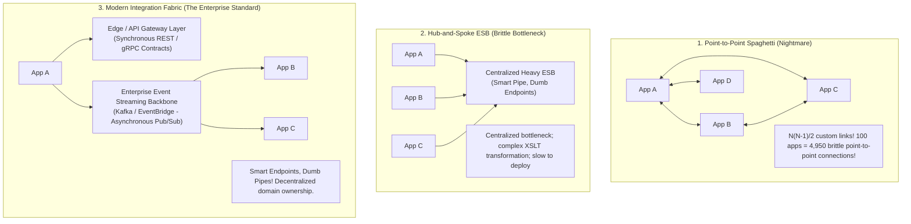

# Enterprise Integration Architecture: Protocols, Mediation & Event Backbones

> **Domain**: `01-architecture/enterprise-architecture`  
> **Status**: Approved  
> **Target Audience**: Enterprise Integration Architects, Solution Architects, API Leaders

---

## 1. Simple Explanation

In a global corporation with hundreds of disparate systems (ERP, CRM, Core Banking, Legacy Mainframes, Modern Cloud Microservices, SaaS platforms), **Enterprise Integration Architecture** defines the protocols, data contracts, middleware patterns, and message pipelines that enable these separate applications to communicate reliably and securely without devolving into point-to-point spaghetti.

---

## 2. The Evolution of Enterprise Integration Topologies



---

## 3. The 4 Integration Interaction Models

Enterprise architectures categorize integration interactions into four distinct patterns:

```text
┌─────────────────────────────────────────────────────────────┐
│                 ENTERPRISE INTEGRATION MODELS               │
├───────────────────┬─────────────────────────────────────────┤
│ 1. Synchronous    │ RESTful HTTP/2, gRPC. Real-time query   │
│    Request-Reply  │ and immediate user interactions.        │
├───────────────────┼─────────────────────────────────────────┤
│ 2. Asynchronous   │ Apache Kafka, RabbitMQ. Event-driven    │
│    Pub/Sub Events │ domain notifications, high throughput.  │
├───────────────────┼─────────────────────────────────────────┤
│ 3. Batch ETL/ELT  │ Apache Airflow, dbt, Snowflake. Mass    │
│    Data Pipelines │ analytical ingestion, overnight batches.│
├───────────────────┼─────────────────────────────────────────┤
│ 4. Managed File   │ SFTP, AWS Transfer Family. Legacy B2B   │
│    Transfer (MFT) │ financial clearing files (NACHA, SWIFT).│
└───────────────────┴─────────────────────────────────────────┘
```

---

## 4. Enterprise Integration Patterns (Gregor Hohpe & Bobby Woolf)

The canonical integration patterns implemented in modern integration frameworks (Apache Camel, Spring Integration, Azure Logic Apps):
1. **Message Router**: Evaluates incoming message headers or payload content and routes to the appropriate destination without altering message content.
2. **Content Enricher**: Intercepts a lightweight event (e.g., `OrderCreated { orderId: 1001 }`), calls an internal database, appends full customer details, and forwards the enriched message to downstream consumers.
3. **Splitter & Aggregator**: Takes a composite bulk order containing 50 line items, splits it into 50 individual item messages for parallel processing, and aggregates the 50 results back into a single confirmation.
4. **Idempotent Receiver**: Discards duplicate messages using a distributed Redis deduplication cache.
