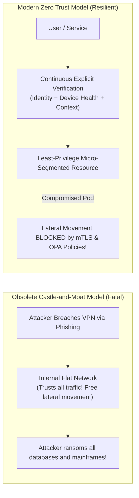

# Enterprise Security Architecture: Zero Trust & Defense-in-Depth

> **Domain**: `01-architecture/enterprise-architecture`  
> **Status**: Approved  
> **Target Audience**: Enterprise Security Architects, CISOs, Solution Architects

---

## 1. Simple Explanation

**Enterprise Security Architecture** establishes a comprehensive, multi-layered security posture across an entire corporation's technology landscape. It replaces the obsolete "Castle-and-Moat" security perimeter model with a modern **Zero Trust Architecture** that operates on a single founding axiom: **"Never trust, always verify."**

---

## 2. The Death of the Castle-and-Moat Model

Historically, corporations treated the internal corporate network (behind the physical office firewall or VPN) as "trusted", and the public internet as "untrusted".



---

## 3. The 3 Core Pillars of Zero Trust (NIST SP 800-207)

1. **Explicit Verification Always**: Authenticate and authorize every request based on all available data points (user identity, location, device health state, service identity, data classification, and anomalies).
2. **Use Least Privilege Access**: Limit user and service access with Just-In-Time (JIT) and Just-Enough-Access (JEA) permissions.
3. **Assume Breach**: Minimize blast radius by segmenting networks, encrypting all internal communications, and continuously monitoring for anomalous telemetry.

---

## 4. Enterprise Defense-in-Depth Topology

Security is not a single tool; it is a layered defensive system:

```text
┌─────────────────────────────────────────────────────────────┐
│                 ENTERPRISE DEFENSE-IN-DEPTH                 │
├─────────────────┬───────────────────────────────────────────┤
│ Layer 1: Edge   │ Cloudflare DDoS Protection, Bot Management│
├─────────────────┼───────────────────────────────────────────┤
│ Layer 2: Network│ WAF, Network Firewalls, Isolated Subnets  │
├─────────────────┼───────────────────────────────────────────┤
│ Layer 3: Host   │ Distroless OCI Containers, Read-Only FS   │
├─────────────────┼───────────────────────────────────────────┤
│ Layer 4: Mesh   │ Istio mTLS with SPIFFE/SPIRE x509 Certs   │
├─────────────────┼───────────────────────────────────────────┤
│ Layer 5: App    │ SAST/DAST scanning, OWASP Top 10 defenses │
├─────────────────┼───────────────────────────────────────────┤
│ Layer 6: Data   │ AES-256 Envelope Encryption, Masked PII   │
├─────────────────┼───────────────────────────────────────────┤
│ Layer 7: SIEM   │ Centralized immutable audit logs & alerts │
└─────────────────┴───────────────────────────────────────────┘
```

---

## 5. Security Governance & Threat Modeling (STRIDE)

Enterprise Security Architects enforce **Threat Modeling** during early solution design:
* Every architectural initiative must submit a STRIDE Threat Model (Spoofing, Tampering, Repudiation, Information Disclosure, Denial of Service, Elevation of Privilege) documented in the [Security Design Template](../../16-architecture-deliverables/SECURITY-DESIGN-TEMPLATE.md).
* Pre-commit hooks and CI pipelines enforce automated **Software Composition Analysis (SCA)** and **Static Application Security Testing (SAST)**, automatically failing builds if high-severity CVEs are introduced into code repositories.
