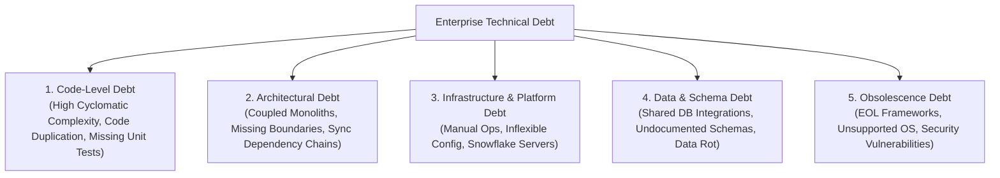
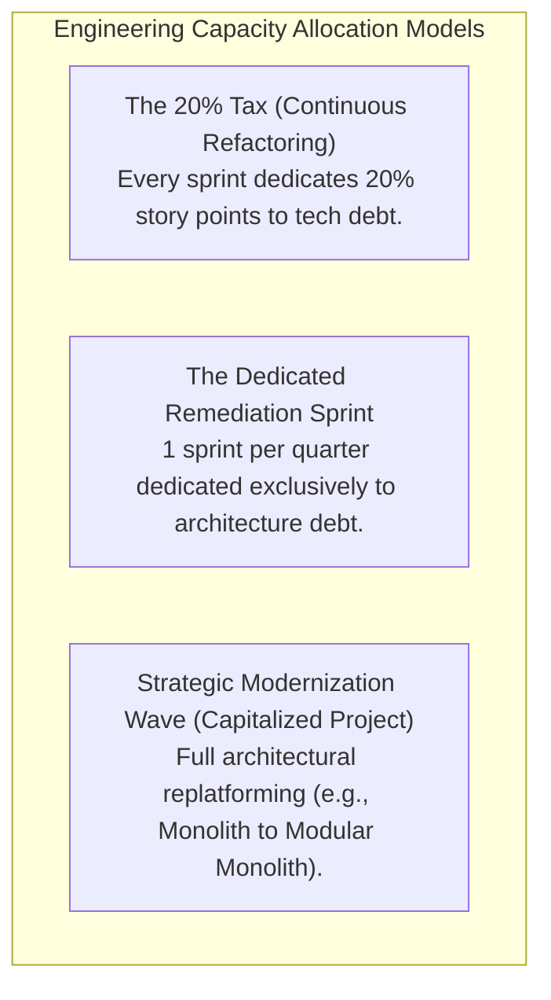

# Technical Debt Management

## Overview

Technical debt represents the implied cost of future rework caused by choosing an expedient, short-term solution now instead of using a better approach that would take longer. In enterprise organizations, unmanaged technical debt behaves exactly like high-interest financial debt: if interest payments (ongoing maintenance friction, incident triage, and brittle manual releases) exceed the engineering organization's capacity, all forward innovation halts.

Enterprise Architects must transform technical debt from an emotional, developer complaint into a quantified, financial, and risk-oriented metric that C-suite leaders can fund and govern.

---

## Technical Debt Taxonomy

Technical debt manifests across multiple enterprise layers, each with distinct causes and remediation costs:



---

## Debt Classification Matrix (Martin Fowler's Debt Quadrant)

```
                     Reckless                       Prudent
           +---------------------------+---------------------------+
           | "We don't have time for   | "We must ship now and     |
Deliberate | design or architecture,   | will deal with the refactor|
           | just push code."          | in Q3 under sprint X."    |
           | (Toxic Debt)              | (Strategic Debt)          |
           +---------------------------+---------------------------+
           | "What is layer isolation? | "Now that we understand   |
Inadvertent| What is an ORM?"          | the domain at scale, we   |
           | (Incompetence / Lack      | see how it should have    |
           |  of Governance)           |  been structured."        |
           |                           | (Evolutionary Debt)       |
           +---------------------------+---------------------------+
```

---

## Measuring and Quantifying Technical Debt

To prioritize debt alongside business features, architects use objective estimation formulas:

### 1. The Financial Debt Ratio (TDR)

$$\text{Technical Debt Ratio (TDR)} = \frac{\text{Remediation Cost (Cost to Fix)}}{\text{Development Cost (Cost to Rebuild)}} \times 100$$

- **Target**: A healthy enterprise application estate maintains a TDR of **under 5%**.
- **Critical Threshold**: A TDR **exceeding 20%** signals an architectural dead-end where full refactoring or system replacement (TIME: Eliminate/Migrate) becomes more cost-effective than continuous maintenance.

### 2. The Interest Drag Metric
$$\text{Debt Interest} = \frac{\text{Hours Spent on Unplanned Work + Incident Remediation + Patching}}{\text{Total Engineering Capacity (Sprint Hours)}} \times 100$$

When the Debt Interest exceeds 30%, teams enter the **"Legacy Death Spiral"**, where no capacity remains for product features.

---

## Enterprise Debt Register

Technical debt must be logged in the centralized issue tracker (e.g., Jira / Azure DevOps) using a standardized **Technical Debt Register** template:

| Field | Description | Example |
|:---|:---|:---|
| **Debt ID** | Unique alphanumeric tracking ID | `TD-FIN-042` |
| **Component** | Impacted subsystem / service | `Billing Engine / PaymentGatewayAdapter` |
| **Debt Category** | Architecture / Obsolescence / Security / Code | `Architectural Debt (Sync Bottleneck)` |
| **Principal Cost** | Estimated effort/cost to eliminate debt | `6 Sprints (120 Engineering Days / $120,000)` |
| **Monthly Interest** | Ongoing engineering loss / operational drag | `15 hours/week ($7,500/month) + 2 P1 outages/yr` |
| **Blast Radius** | Business impact if left unaddressed | `Single-point-of-failure blocks PCI DSS 4.0 certification` |
| **Target Remediation Window**| Scheduled fiscal quarter / release train | `2027-Q2 Refactoring Wave` |

---

## Remediation Strategies & Investment Allocation

Enterprises balance debt retirement through three complementary allocation strategies:



### The "Boy Scout Rule" vs. Modernization Programs
- **Micro-Debt (Code level)**: Solved continuously via the Boy Scout Rule ("leave the code cleaner than you found it") during standard feature delivery.
- **Macro-Debt (Architectural/Platform)**: Requires formal Architecture Decision Records (ADRs), executive funding, and multi-sprint migration programs orchestrated through strangler facades.
