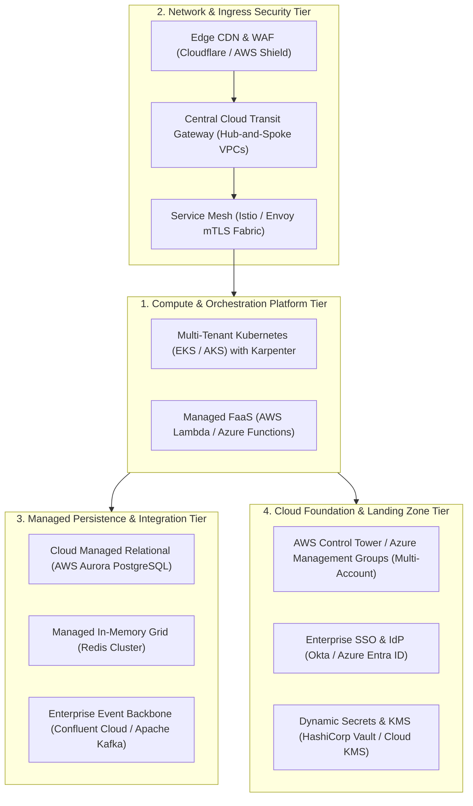

# Enterprise Technology Architecture: Infrastructure & Platform Standards

> **Domain**: `01-architecture/enterprise-architecture`  
> **Status**: Approved  
> **Target Audience**: Enterprise Technology Architects, Platform Engineering Leads, Cloud Infrastructure Directors

---

## 1. Simple Explanation

**Technology Architecture** (the "T" in TOGAF) specifies the logical and physical technology infrastructure—cloud platforms, computing hardware, operating systems, container runtimes, networks, and middleware—required to support the execution of all enterprise business and application services.

---

## 2. The Enterprise Platform Architecture Blueprint

In a modern cloud-first enterprise, Technology Architecture is organized into four standardized foundational tiers:



---

## 3. Technology Standardization: The "Paved Path" Strategy

A core failure in historical technology governance was mandating strict technology standardization by decree, forcing developers into shadow IT.

Modern Technology Architecture succeeds by providing **The Paved Path (Golden Path)**:
* **The Paved Path**: The Platform Engineering team provides turnkey, fully automated, pre-approved software templates (via Backstage or GitHub Scaffolding).
  * A developer clicks one button: they receive a repository with .NET 8 / Java 21, automated CI/CD pipelines, security scanning, container hardening, and Terraform infrastructure already configured and compliant with enterprise security standards.
* **The Freedom**: If a team chooses *not* to use the paved path, they are legally permitted to use custom tools, but **they inherit 100% of the operational and compliance burden**: they must build their own CI/CD, pass penetration tests independently, and provide 24/7 on-call SRE support.
* **Result**: 90%+ of engineering squads voluntarily adopt enterprise technology standards because it is the fastest route to production!

---

## 4. Multi-Cloud Reality: Portability vs. Cloud-Native Velocity

Enterprise Architects are often pressured by executives to mandate **"100% Multi-Cloud Portability"** (the dream of running workloads seamlessly across AWS, Azure, and Google Cloud).

```text
┌─────────────────────────────────────────────────────────────┐
│                 THE MULTI-CLOUD PORTABILITY TRAP            │
├─────────────────────────────────────────────────────────────┤
│ 1. Lowest-Common-Denominator Tax:                           │
│    - If you force apps to run identically on AWS and Azure, │
│      you cannot use advanced managed primitives (DynamoDB,  │
│      BigQuery, Aurora, EventBridge).                        │
│    - You are forced to self-host basic Linux VMs and raw    │
│      databases, forfeiting cloud productivity benefits.     │
├─────────────────────────────────────────────────────────────┤
│ 2. The Modern Strategy: Best-of-Breed Cloud Placement:      │
│    - Run enterprise productivity & AD on Microsoft Azure.   │
│    - Run core high-throughput APIs & compute on AWS.        │
│    - Run advanced machine learning & analytics on GCP.      │
│    - Connect clouds via dedicated private interconnects.    │
└─────────────────────────────────────────────────────────────┘
```
