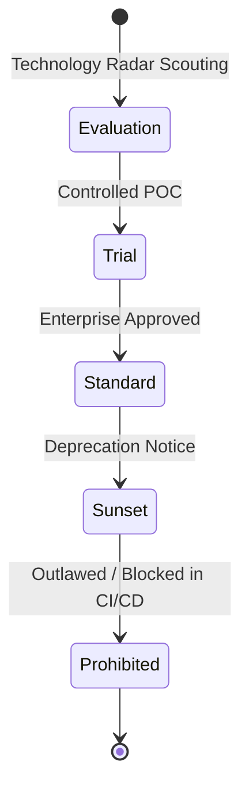
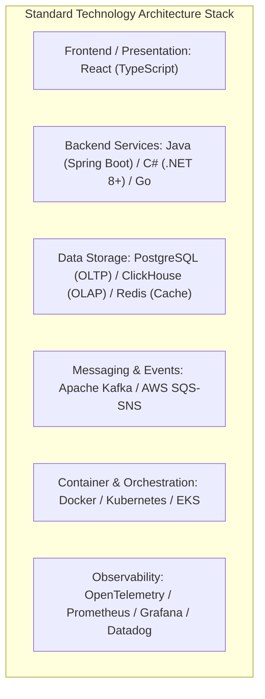
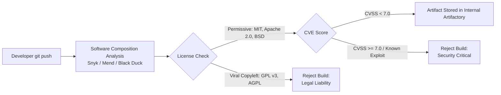
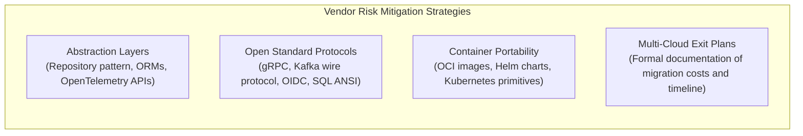

# Technology Portfolio Management (TPM)

## Overview

Technology Portfolio Management (TPM) is the enterprise architecture discipline responsible for governing the lifecycle, procurement, standardization, and obsolescence of the technical components underpinning an organization's software assets. While Application Portfolio Management (APM) manages "what the business uses," TPM governs "what technologies applications are built with" (e.g., programming runtimes, database engines, message queues, container orchestrators, web frameworks, and third-party libraries).

Unchecked technology proliferation introduces operational friction, vendor lock-in vulnerabilities, hiring fragmentation, security patch delays, and escalating multi-million dollar support penalties.

---

## Technology Lifecycle States

Every software technology evaluated or adopted across the enterprise must be assigned one of five explicit lifecycle states:

| Lifecycle State | Definition | Governance Policy & Action |
|:---|:---|:---|
| **Evaluate** | Candidate technology undergoing structured proof-of-concept (POC). | Restricted to sandboxed environments; prohibited from handling production traffic or PII. |
| **Trial** | Proven candidate deployed in low-risk production workload to evaluate operability at scale. | Requires Enterprise Architecture Board (EAB) waiver; maximum 2 trial workloads for 90 days. |
| **Standard** | Officially sanctioned platform for all new projects and architectural redesigns. | Pre-integrated into CI/CD pipelines, security baselines, centralized monitoring, and vendor contracts. |
| **Sunset** | Legacy standard entering planned obsolescence; no new greenfield usage allowed. | Teams must formulate active migration plans within 12–24 months; high-cost extended support budgeted. |
| **Prohibited** | End-of-Life (EOL), unpatched, compromised, or legally toxic technologies. | Automated build breakers in CI/CD pipelines prevent deployment; immediate executive escalation. |

---

## The Technology Standardization Matrix

Global enterprises achieve operational leverage by maintaining a curated, standard technology stack across standard architectural layers:

### The "Paved Road" (Golden Paths)
The core mechanism for driving technology portfolio compliance is the **Paved Road**:
- Teams adopting Standard technologies receive automated CI/CD pipelines, out-of-the-box zero-trust authentication templates, security compliance baselines, automated telemetry, and 24/7 centralized infrastructure support.
- Teams attempting to introduce non-standard technologies incur the "tax" of building, securing, monitoring, and operating their own tooling, subject to formal EAB waivers.

---

## Open-Source Software (OSS) Governance

Open-source packages constitute 80–90% of modern software binaries. TPM establishes an automated policy engine integrated into the developer supply chain:

### License Risk Taxonomy
1. **Permissive (Low Risk)**: MIT, Apache 2.0, BSD 2/3-Clause, ISC. Fully authorized for commercial SaaS and enterprise deployments.
2. **Weak Copyleft (Medium Risk)**: LGPL, MPL. Permitted only if consumed as dynamically linked external libraries without source-code modification.
3. **Strong / Network Copyleft (Prohibited Risk)**: GPL v3, AGPL, SSPL. Strict prohibition for enterprise proprietary software due to viral source-code disclosure requirements.

---

## Vendor Management & Lock-In Mitigation

Enterprises balance cloud-native acceleration against commercial and vendor lock-in risks:

### The Vendor Concentration Risk Matrix
- **Tier 1 Strategic Vendors** (e.g., AWS, Microsoft Azure, Oracle, SAP): Monitored quarterly by the CIO/EAB for price inflation, contract renewal cliff events, and regulatory geo-compliance.
- **Contractual Exit Plan Mandate**: Any vendor agreement exceeding $1M/year must maintain an architect-approved "Exit Strategy Document" defining data extraction formats, migration window estimates, and financial cost to transition.

---

## Technology Portfolio Health Metrics

1. **Golden Path Adoption Rate**: Percentage of enterprise microservices built strictly using "Standard" paved-road technologies (target: > 85%).
2. **EOL Component Defect Density**: Number of production workloads running on runtimes past vendor End-of-Life (target: 0).
3. **Software Bill of Materials (SBOM) Coverage**: Percentage of deployed artifacts with fully automated, machine-readable SBOM generation (SPDX / CycloneDX format).
4. **License Compliance Rate**: Zero viral copyleft packages detected in commercial enterprise artifacts.
