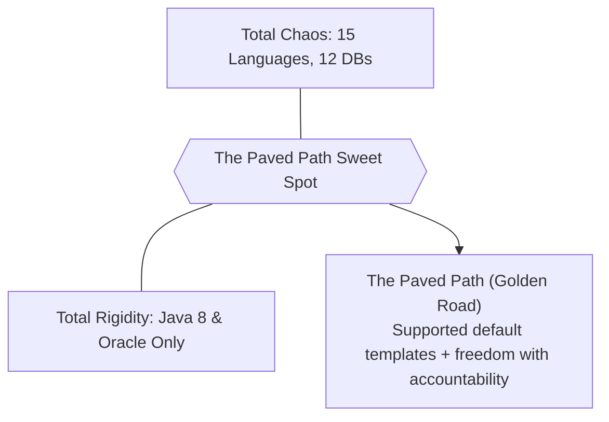

# Enterprise Technology Standards & Paved Paths

> **Domain**: `01-architecture/enterprise-architecture`  
> **Status**: Approved  
> **Target Audience**: Enterprise Architects, Platform Engineering Leads, Staff Engineers

---

## 1. Simple Explanation

**Enterprise Technology Standards** define the curated portfolio of approved programming languages, frameworks, cloud services, and third-party tools that an organization officially supports. Standards prevent software fragmentation, enable developer mobility across teams, control cloud licensing costs, and streamline security patching.

---

## 2. The Danger of Unconstrained Freedom vs. Heavy Mandates

```text
┌─────────────────────────────────────────────────────────────┐
│                 THE STANDARDIZATION SPECTRUM                │
├───────────────────┬─────────────────────────────────────────┤
│ TOTAL FREEDOM     │ RIGID MANDATE                           │
│ (Startup Chaos)   │ (Legacy Corporate Bureaucracy)          │
├───────────────────┼─────────────────────────────────────────┤
│ Every squad picks │ A single language & tool mandated for   │
│ whatever they like│ 50,000 employees worldwide.             │
│ (8 languages, 12  │ Prevents modern innovation; demoralizes │
│ databases). Team  │ top engineering talent; sparks shadow IT│
│ mobility zero.    │ and workarounds.                        │
└───────────────────┴─────────────────────────────────────────┘
```



---

## 3. The Paved Path (Golden Path) Architecture

Modern enterprise technology standards are operationalized through **Paved Paths**:
1. **Curated Technology Tier (ADOPT Ring)**:
   * **Backend**: .NET 8+ / C#, Java 21+ / Spring Boot 3, Python 3.11+ (Data/AI), TypeScript / Node.js (BFF).
   * **Frontend**: React (Next.js), Angular.
   * **Persistence**: PostgreSQL 16+ (Relational), Redis Cluster (Cache), OpenSearch (Search).
   * **Messaging**: Apache Kafka.
   * **Cloud**: AWS / Azure with Terraform and Kubernetes (EKS/AKS).
2. **Turnkey Scaffolding**: Platform Engineering provides pre-packaged repository templates in Backstage. A developer clicks "Create Microservice" and gets a compliant, hardened repository with CI/CD, telemetry, and security scanners built in.
3. **The Freedom-with-Accountability Rule**: A team may request a non-standard technology (e.g., Rust for ultra-low latency or Go for high-throughput network proxies). They must submit an ADR justifying the choice; if approved, the squad owns all operational, CI/CD, and on-call responsibilities.

---

## 4. Lifecycle Governance of Technology Standards

Technologies advance through standard enterprise lifecycle stages managed via the [Technology Radar](../../TECHNOLOGY-RADAR.md):

```mermaid
stateDiagram-v2
    [*] --> Assess: Candidate spotted (99-experiments)
    Assess --> Trial: Successful POC; pilot on non-critical project
    Trial --> Adopt: Production-proven at scale; added to Paved Path
    Adopt --> Hold: Superseded or security liability; retirement plan initiated
    Hold --> [*]: Fully decommissioned
```
