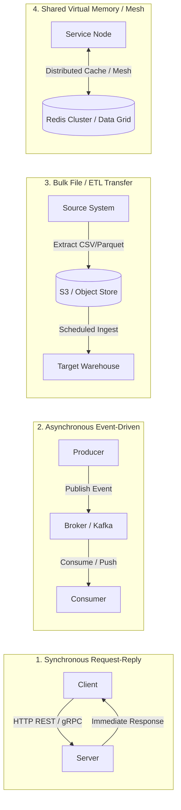
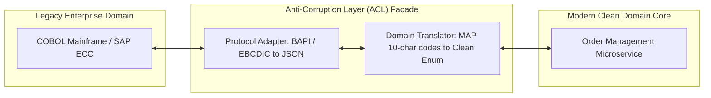

# Integration Architecture: Communication Styles, Topologies, and Boundaries

## 1. Architectural Overview & Context
**Integration Architecture** governs the protocols, communication topologies, boundary translations, and consistency contracts that connect decoupled systems across an enterprise.

In distributed architectures, independent components cannot share a single database without destroying service autonomy and introducing catastrophic database locking contention. Integration architecture replaces shared storage with explicit, observable communication channels.

```
Shared Database Integration (Anti-Pattern)        Decoupled Integration Architecture (Standard)
┌───────────────────────────────────────┐         ┌──────────────┐              ┌──────────────┐
│ Service A           Service B         │         │  Service A   │              │  Service B   │
│     │                   │             │         │ (Private DB) │              │ (Private DB) │
│     ▼                   ▼             │         └──────┬───────┘              └──────▲───────┘
│   [Single Monolithic Database]        │                │                             │
│   - Hidden coupling                   │                └───► [Explicit Contract] ────┘
│   - Concurrent schema lock risks      │                      - REST / gRPC (Sync)
│   - Zero blast-radius isolation       │                      - Event Backbone (Async)
└───────────────────────────────────────┘
```

---

## 2. The 4 Fundamental Integration Styles

Every integration mechanism falls into one of four architectural archetypes:



| Integration Style | Latency Profile | Coupling Level | Typical Enterprise Fit | Failure Characteristics |
|---|---|---|---|---|
| **Synchronous RPC / REST** | Low ($< 100\text{ms}$) | High (Temporal & Spatial) | Interactive UI transactions, real-time validations | Cascading failure; client blocked during downstream outage |
| **Asynchronous Messaging** | Variable ($50\text{ms} - 5\text{s}$) | Low (Temporal decoupling) | Order processing, billing pipelines, cross-domain notifications | Queuing backlog; eventual consistency; requires idempotency |
| **Batch / File Transfer** | High (Hours / Days) | Very Low (Offline) | Nightly general ledger feeds, payroll settlement | Large batch errors require replay of full files |
| **Event-Carried State** | Low-to-Medium | Ultra-Low (Local cache) | High-throughput read caching across boundaries | Eventual consistency; consumer data staleness during lag |

---

## 3. Orchestration vs. Choreography Decision Framework

When a business process spans multiple services (e.g., *Order Placement* $\rightarrow$ *Payment Processing* $\rightarrow$ *Inventory Allocation* $\rightarrow$ *Shipping*):

```
Orchestration (Conductor Pattern)                   Choreography (Dancer Pattern)
┌───────────────────────────────┐                  ┌────────────────────────────────────────┐
│      [Order Orchestrator]     │                  │  [Order] ──OrderCreated──► [Payment]   │
│      ├── 1. Call Payment      │                  │                                │       │
│      ├── 2. Call Inventory    │                  │                        PaymentProcessed│
│      └── 3. Call Shipping     │                  │                                ▼       │
│                               │                  │  [Shipping] ◄──StockReserved── [Stock] │
│ - Explicit workflow state     │                  │ - Extreme loose coupling               │
│ - Single point of monitoring  │                  │ - Complex decentralized debugging      │
└───────────────────────────────┘                  └────────────────────────────────────────┘
```

| Decision Factor | Prefer Orchestration (Temporal / Step Functions) | Prefer Choreography (Kafka / EventBridge) |
|---|---|---|
| **Process Complexity** | High (Multi-step branching, compensations, timers) | Low (Fire-and-forget notifications) |
| **State Visibility** | Central audit trail and workflow visualization required | Ephemeral reactions across autonomous squads |
| **Blast Radius** | Central orchestrator change risk | Distributed event loop bugs & cyclic dependencies |

---

## 4. Boundary Protection: The Anti-Corruption Layer (ACL)

When modernizing a system or integrating with legacy COTS (ERP/Mainframes), never allow legacy domain models to pollute core microservices:



---

## 5. Architectural Ownership Boundaries

To maintain clarity across this handbook:
* **This Module ([`01-architecture/integration-architecture/`](README.md))**: Focuses on **conceptual integration architecture**, style selection, orchestration vs choreography, and boundary governance.
* **[07-integration/](../../07-integration/)**: Focuses on **generic integration protocols and middleware engineering** (REST guidelines, Webhooks, RabbitMQ topologies, and Kafka partitioning).
* **[14-enterprise-integration/](../../14-enterprise-integration/)**: Focuses on **deep industry-specific integration suites** (Banking ISO 20022, Healthcare FHIR/HL7, Payment Gateways/PCI-DSS, SAP S/4HANA OData, Salesforce CDC, and financial break reconciliation).

---

## 6. Integration Architecture Checklist
- [ ] Eliminate shared database integrations across autonomous service boundaries.
- [ ] Select synchronous vs asynchronous communication based on latency budgets and coupling tolerance.
- [ ] Enforce an Anti-Corruption Layer (ACL) between core domain services and external/legacy APIs.
- [ ] Implement deterministic idempotency keys for all state-mutating requests.
- [ ] Propagate W3C distributed trace contexts (`traceparent`) across all synchronous and asynchronous hops.
- [ ] Provide explicit compensation routines (Sagas) for multi-step distributed workflows.

---

## 7. Related Modules
* [07-integration/](../../07-integration/) — Protocol-level integration engineering, webhooks, and broker architectures.
* [14-enterprise-integration/](../../14-enterprise-integration/) — Deep industry vertical integrations (SAP, Salesforce, ISO 20022).
* [02-system-design/fault-tolerance/](../../02-system-design/fault-tolerance/README.md) — Circuit breaking, retries, and backpressure patterns.
