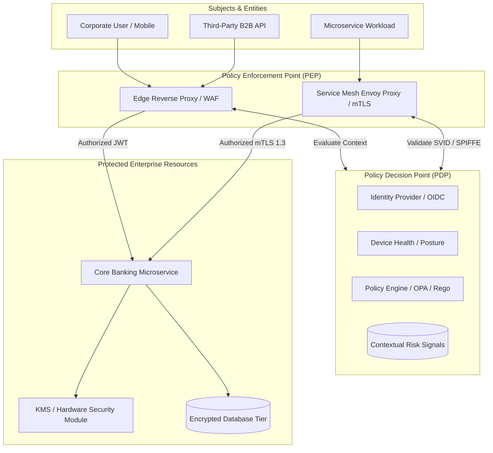

# Security Architecture: Zero Trust, Threat Modeling, and Cryptographic Posture

## 1. Architectural Overview & Context
**Security Architecture** defines how an enterprise designs defensive boundaries, establishes cryptographic trust, manages identities, and validates operations to safeguard assets against intentional compromise and operational error.

Modern security architecture rejects the obsolete **Perimeter Defense (Castle-and-Moat)** model. In an era of remote work, multi-cloud platforms, and SaaS integration, the internal network must be treated with the exact same zero-trust posture as the public internet.

```
Obsolete Castle-and-Moat Architecture             Modern Zero Trust Architecture (NIST 800-207)
┌───────────────────────────────────────┐         ┌───────────────────────────────────────┐
│ Strong Firewall Perimeter             │         │ Continuous Mutual Authentication      │
│ Implicit Trust on Internal Network    │  ──►───►│ Explicit Per-Request Authorization    │
│ Vulnerable to lateral movement        │         │ Micro-segmentation & Least Privilege  │
│ Single breach compromises all systems │         │ Cryptographic isolation of data tiers │
└───────────────────────────────────────┘         └───────────────────────────────────────┘
```

---

## 2. Zero Trust Enterprise Architecture Blueprint



---

## 3. Core Architectural Security Pillars

### 3.1. Identity & Access Management (IAM) Topology
* **Authentication (AuthN)**: Who are you? Standardized via **OpenID Connect (OIDC)** and SAML 2.0. Passwords deprecated in favor of FIDO2 / WebAuthn passwordless biometric tokens.
* **Authorization (AuthZ)**: What are you allowed to do?
  * **RBAC (Role-Based)**: Coarse-grained roles (`Admin`, `Viewer`).
  * **ABAC (Attribute-Based)**: Fine-grained policies evaluating attributes (User Department, Resource Classification, Time of Day, Geographic IP). Enforced via Open Policy Agent (OPA).

### 3.2. Cryptographic Posture & Data Protection
```
┌─────────────────────────────────────────────────────────────────────────────┐
│                       DATA PROTECTION ARCHITECTURE                          │
├───────────────────────┬─────────────────────────────────────────────────────┤
│ Data in Transit       │ Enforce TLS 1.3 exclusively. Mutual TLS (mTLS) with │
│                       │ ephemeral certificates across all service-to-service│
├───────────────────────┼─────────────────────────────────────────────────────┤
│ Data at Rest          │ AES-256-GCM. Envelope encryption using cloud KMS /  │
│                       │ HSM. Master Key encrypts Data Encryption Keys (DEKs)│
├───────────────────────┼─────────────────────────────────────────────────────┤
│ Data in Use           │ Confidential Computing (AMD SEV / Intel SGX) for    │
│                       │ untrusted cloud environments; memory encryption     │
└───────────────────────┴─────────────────────────────────────────────────────┘
```

### 3.3. Envelope Encryption Architecture
```
Client Service                        Key Management Service (KMS)
      │                                             │
      ├──── 1. GenerateDataKey(MasterKeyId) ───────►│
      │                                             │
      │◄─── 2. Returns: Plaintext DEK + Encrypted DEK─┤
      │                                             │
      ├── 3. Encrypt data with Plaintext DEK        │
      ├── 4. Zeroize Plaintext DEK from RAM         │
      └── 5. Store Encrypted Data + Encrypted DEK together in DB
```

---

## 4. Threat Modeling: STRIDE Architecture Evaluation

Architects must perform structured threat modeling during the design phase (before writing code):

| STRIDE Category | Threat Description | Architectural Mitigation |
|---|---|---|
| **S - Spoofing** | Adversary pretends to be a valid user or service | Enforce mTLS with SPIFFE/SPIRE identities; hardware-backed MFA |
| **T - Tampering** | Adversary modifies data in transit or database | Cryptographic HMAC signatures; append-only immutable audit logs |
| **R - Repudiation** | User denies performing a transaction | Non-repudiation via digital signatures and W3C distributed trace logs |
| **I - Information Disclosure**| Sensitive customer PII exposed | Envelope encryption, tokenization, strict egress DLP scanning |
| **D - Denial of Service** | Exhaustion of network, compute, or database | Cloudflare edge DDoS shielding, leaky-bucket rate limiting, resource quotas |
| **E - Elevation of Privilege**| Standard user acquires administrator permissions | Strict least privilege, ABAC policy enforcement, short-lived tokens |

---

## 5. Security Architecture Review (SAR) Checklist
- [ ] Enforce TLS 1.3 across all external endpoints and internal service-to-service communication.
- [ ] Eliminate long-lived static credentials; adopt short-lived OAuth 2.0 access tokens ($\le 60\text{m}$) and IAM roles.
- [ ] Implement Envelope Encryption (AES-256) for all databases, message queues, and object storage.
- [ ] Maintain an automated Software Bill of Materials (SBOM) and container vulnerability scanning in CI/CD.
- [ ] Route all audit events to a tamper-proof, write-once-read-many (WORM) security data lake.
- [ ] Review threat model and STRIDE mitigation boundaries before production go-live.

---

## 6. Related Modules
* [10-security/](../../10-security/) — Implementation playbooks: application security, vulnerability management, and secret stores.
* [11-observability/](../../11-observability/) — Security information and event management (SIEM), audit telemetry, and anomaly detection.
* [23-enterprise-architecture/](../../23-enterprise-architecture/) — Enterprise risk governance, compliance frameworks (SOC2, ISO 27001), and CISO alignment.
