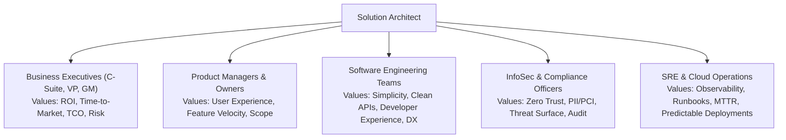
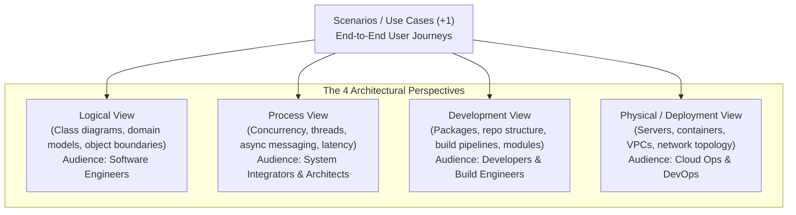

# Architecture Communication & Stakeholder Management

## Overview

Software architecture is as much a communication and social discipline as it is a technical one. An architect can design the most elegant, highly scalable, mathematically pure distributed system in the world, but if they cannot articulate its value to executives, align product managers, guide delivery engineers, and reassure security officers, the architecture will never see production.

Effective Solution Architects adapt their vocabulary, level of detail, and visual representations to the specific mental models and priorities of diverse enterprise stakeholders.

---

## Stakeholder Persona Matrix



---

## Tailoring Architecture Deliverables by Audience

| Stakeholder Group | Primary Concerns & Vocabulary | Appropriate Architecture Deliverable | Format / Tone |
|:---|:---|:---|:---|
| **Executive Leadership** | Capital investment, risk exposure, competitive speed, compliance | Executive Summary, Business Capability Impact, 1-page Business Case | High-level, financially oriented, zero technical jargon. Focus on outcomes. |
| **Product Management** | Feature release schedules, user latency, SLA commitments | User Journey Mappings, C4 System Context Diagrams, Dependency Roadmaps | User-centric, workflow-driven, highlighting trade-offs between scope and speed. |
| **Engineering Teams** | Frameworks, data schemas, API contracts, error codes, local dev | C4 Container & Component Diagrams, OpenAPI specs, ADRs, Code Scaffolds | Precise, technical, runnable code examples, clear boundary rules. |
| **InfoSec / SecOps** | Attack surfaces, data at rest/transit encryption, zero trust | STRIDE Threat Models, Data Classification Diagrams, Trust Boundary Maps | Rigorous, compliance-focused, detailing authentication/authorization flows. |
| **SRE / Cloud Ops** | Deployment blast radius, monitoring metrics, MTTR, failover | Deployment Architecture Diagrams, SLO/SLI Definitions, Disaster Recovery Runbooks | Operationally oriented, detailing monitoring alerts, health checks, and capacity. |

---

## Multi-Perspective Architecture Modeling: The 4+1 View Model

To avoid creating cluttered diagrams that try to satisfy everyone at once, Philippe Kruchten established the **4+1 View Model of Architecture**:



---

## The Architectural "Elevator Pitch" Framework

When communicating architecture to senior business leaders in limited time, use the **Headline-Impact-Mechanism (HIM)** structure:

```
1. HEADLINE (The Problem & Decision):
   "To support our planned 300% holiday traffic surge without crashing, we are adopting an asynchronous event-driven checkout architecture."

2. IMPACT (The Business Value & ROI):
   "This eliminates mobile checkout drop-offs, protects $4.2M in peak-hour revenue, and cuts our cloud compute spend by 25%."

3. MECHANISM (How It Works in Simple Terms):
   "Instead of forcing user payments to wait on slow third-party banking networks synchronously, we ingest orders into an ultra-fast resilient message queue and confirm transactions in the background."

4. ASK (The Decision / Support Needed):
   "We need product approval to allow a 2-second pending state on the mobile confirmation screen, and engineering allocation for a 3-week transition spike."
```

---

## Navigating Architectural Conflict & Consensus Building

1. **Focus on Principles, Not Personalities**: Ground discussions in established enterprise architecture principles (e.g., "Loose Coupling", "Buy vs Build") rather than personal preferences.
2. **Make Trade-offs Explicit**: When a stakeholder objects to an architectural constraint, show the radar matrix. Remind them: "We can deliver this in half the time using synchronous REST, but our downtime risk during marketing campaigns will increase by 4x. Is leadership comfortable accepting that risk?"
3. **Disagree and Commit**: Facilitate rigorous debate during the RFC phase of an ADR, but once an architectural decision is ratified by the Architecture Review Board, require all engineering teams to align and commit to execution.
