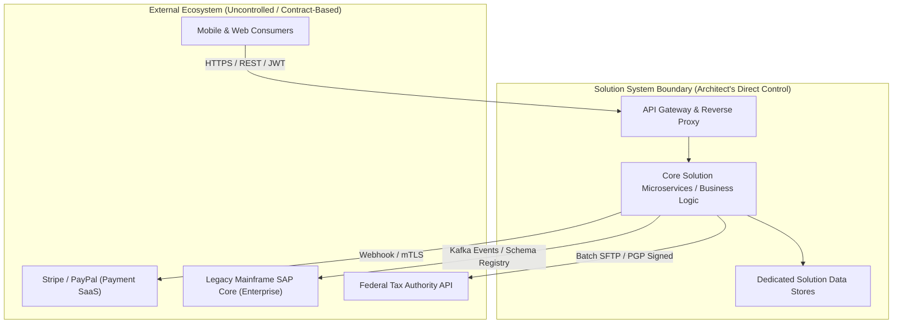
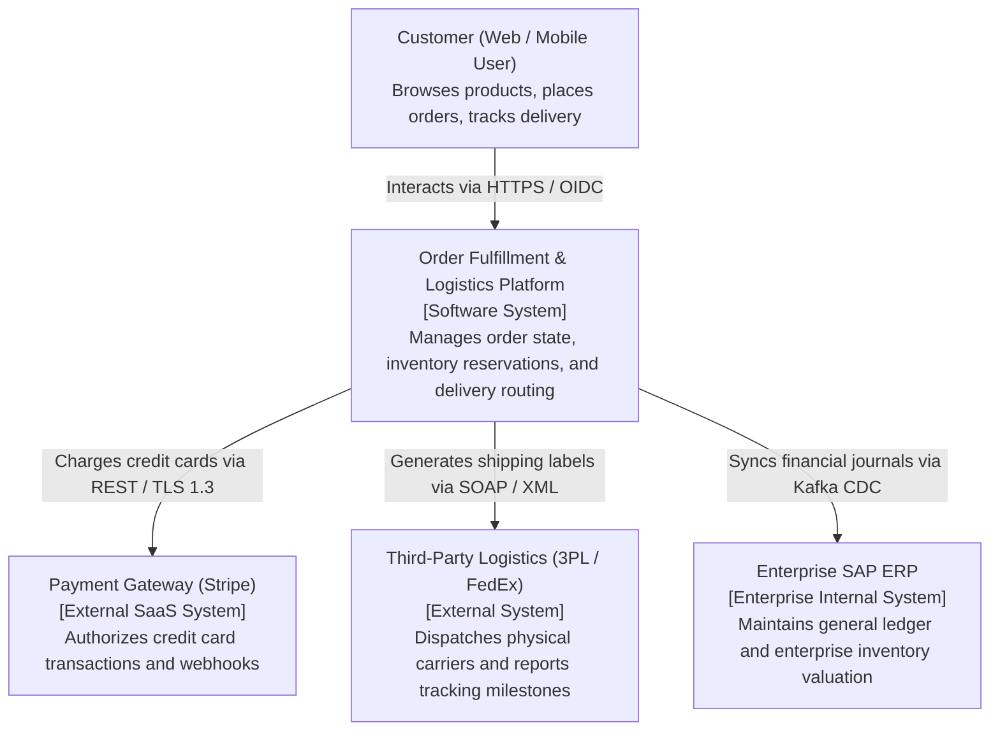

# Architecture Context Analysis

## Overview

Architecture Context Analysis establishes the external boundaries of a proposed system solution. It formally identifies the actors (human users, external enterprise systems, IoT hardware, third-party SaaS vendors) that interact with the system, the data flows crossing the system boundary, and the operational environment in which the system must survive.

Failing to rigorously define the architecture context early is the leading cause of enterprise project failure—resulting in unexpected integration surprises, unbudgeted API dependencies, security boundary confusion, and uncoordinated release schedules.

---

## The System Boundary and Context Boundary

The System Boundary separates what is inside the solution architect's direct design and control from what is external:

---

## Establishing the C4 Context Diagram (Level 1)

The C4 model begins with the System Context diagram. It provides a high-level, zoomed-out view understandable by engineers and C-level executives alike:

---

## The External Dependency Matrix

For every system crossing the architecture context boundary, the architect must document the operational interface contract:

| External System | Dependency Type | Protocol & Auth | SLA / Uptime | Failure Behavior / Fallback Strategy |
|:---|:---|:---|:---|:---|
| **Stripe API** | Synchronous REST | HTTPS, API Key + TLS 1.3 | 99.99% | Circuit breaker trips after 3 consecutive 5xx errors; user prompted for alternative payment method (PayPal/Apple Pay). |
| **Legacy SAP Core**| Asynchronous Messaging | Kafka Topic (JSON Schema) | 99.5% | Local transactional outbox buffers events if Kafka broker is unreachable; zero message loss. |
| **FedEx 3PL** | Synchronous SOAP | HTTPS, Mutual TLS (mTLS) | 99.0% | Queue shipment request in dead-letter queue (DLQ); retry with exponential backoff and jitter over 24 hours. |
| **Twilio SMS** | Synchronous REST | HTTPS, Bearer Token | 99.95% | Non-critical path: fire-and-forget; failure logged without failing the primary customer order flow. |

---

## Architectural Trust Boundaries

The system context boundary is also a **Security Trust Boundary**:
1. **Never Trust Inbound Data**: All payloads crossing the perimeter must undergo strict schema validation (e.g., JSON Schema / Protobuf validation) and sanitization before processing.
2. **Mutual Authentication (Zero Trust)**: Connections crossing network boundaries must enforce cryptographic verification via mutual TLS (mTLS) or OAuth 2.0 Client Credentials with short-lived tokens.
3. **Ingress/Egress Quarantine**: Outbound calls to third-party APIs must route through controlled Egress Gateways with static IP whitelisting, preventing compromised internal services from exfiltrating data.
