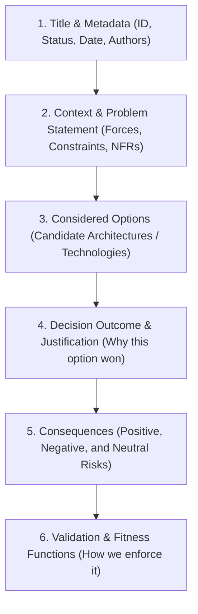
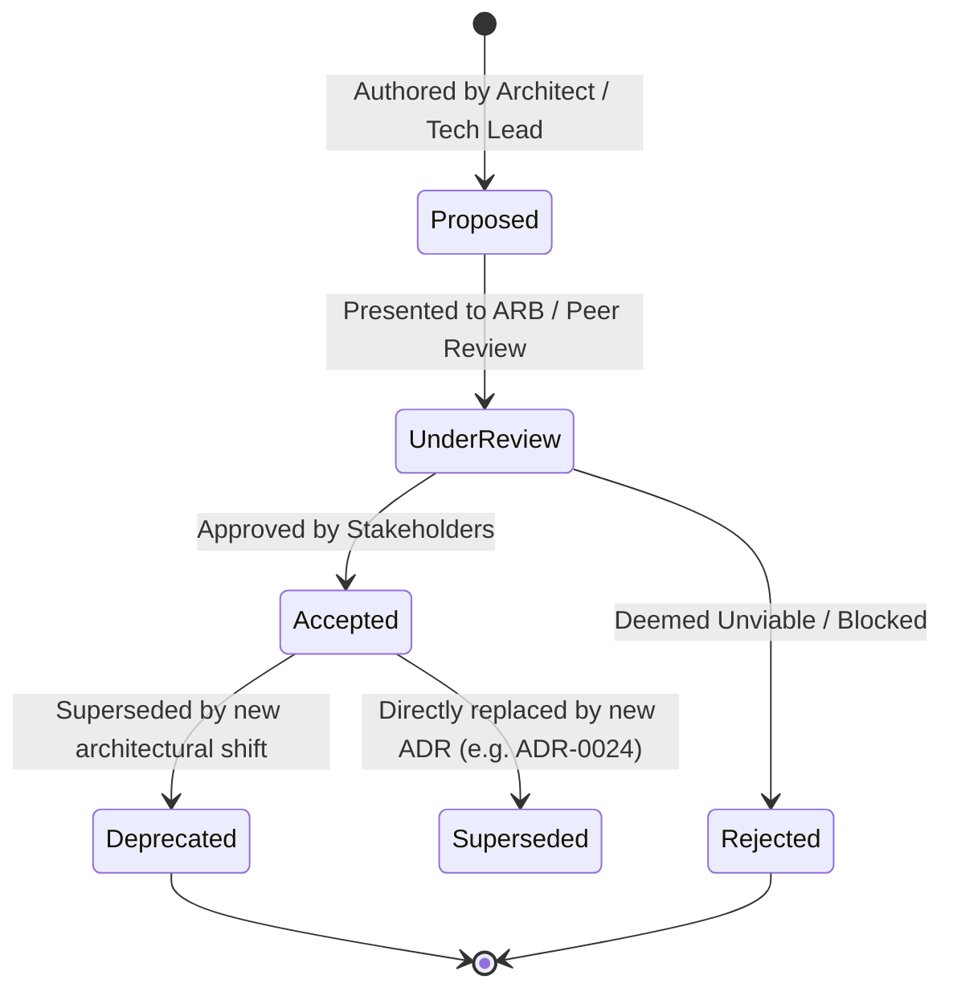

# Architecture Decisions & ADRs

## Overview

Architectural Decision Making is the core intellectual output of a Solution Architect. Every software system is the cumulative result of hundreds of technical decisions—some deliberate and documented, others implicit and accidental. When architectural decisions are made verbally in hallway conversations or buried in ephemeral chat channels, organizations suffer from "architectural amnesia":
- Nobody remembers *why* a particular database, protocol, or boundary was chosen.
- Teams blindly accept suboptimal designs out of fear of breaking unknown dependencies ("Chesterton's Fence").
- New engineers spend months debating already-settled design dilemmas.

An **Architecture Decision Record (ADR)** captures an important architectural decision made along with its context, considered options, trade-offs, and resulting consequences.

---

## Anatomy of a Production-Grade ADR

The most widely adopted standard in modern engineering is Michael Nygard's format, enhanced with explicit trade-off scoring (MADR - Markdown Architectural Decision Records):



---

## The ADR Lifecycle

ADRs are living documents stored in version control alongside the source code they govern:



### Decision States
- **Proposed**: Open for RFC (Request for Comments) feedback from engineering teams and security leads.
- **Accepted**: Officially ratified; teams must implement the decision.
- **Rejected**: Documented as rejected with clear rationale so future teams do not repeat the debate.
- **Superseded**: Replaced by a subsequent ADR (must explicitly link: `Supersedes ADR-0004` and `Superseded by ADR-0019`).

---

## What Deserves an ADR? (The Architecture Threshold)

Not every design decision warrants an ADR. Writing an ADR for trivial choices creates bureaucratic fatigue:

```mermaid
graph TD
    Q1{Does it cross service/team boundaries?}
    Q1 -->|Yes| ADR[Write ADR]
    Q1 -->|No| Q2{Is the cost of reversal extremely high?}
    Q2 -->|Yes| ADR
    Q2 -->|No| Q3{Does it introduce a new database, language, or infrastructure pattern?}
    Q3 -->|Yes| ADR
    Q3 -->|No| Q4{Does it affect critical NFRs (Security, Latency, RPO/RTO)?}
    Q4 -->|Yes| ADR
    Q4 -->|No| NoADR[No ADR Needed: Standard PR / Code Comment]
```

---

## Best Practices for Enterprise ADR Repositories

1. **Store ADRs with Code**: Keep ADRs in the system's Git repository under `docs/adr/` or `architecture/decisions/`. This ensures decisions are versioned, branch-tested, and audited via pull requests.
2. **Immutability of Accepted Decisions**: Once an ADR is `Accepted` and merged to `main`, never edit its historical decision text. If requirements change, author a **new** ADR that supersedes the old one.
3. **Link to Automated Fitness Functions**: Wherever possible, connect an ADR directly to a unit test or linter rule that programmatically enforces the decision in CI/CD pipelines.
4. **Be Honest About Negative Consequences**: An ADR that lists zero negative consequences is either naive or dishonest. Every architectural decision involves a compromise (e.g., higher hosting cost, increased operational latency, or steeper developer learning curves).
