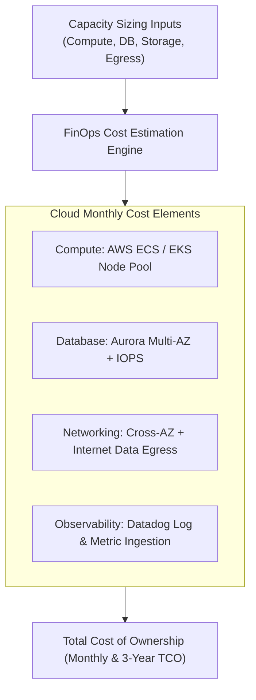
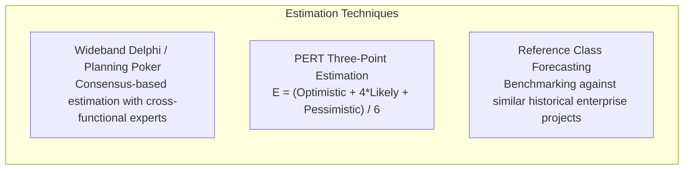

# Architecture Estimation & Capacity Planning

## Overview

Architecture Estimation is the quantitative engineering discipline of projecting a software system's technical requirements (compute, memory, network I/O, storage capacity) and financial operational costs before building it. Architecture without empirical estimation is mere speculation. An architect must be able to calculate back-of-the-envelope capacity projections and formulate multi-year Cloud FinOps models to ensure solutions are physically viable and commercially sustainable.

---

## 1. Back-of-the-Envelope Scale Estimation

Solution Architects use quick, order-of-magnitude calculations to validate whether a candidate architecture can survive projected production loads.

### Essential Numbers Every Architect Must Know

| Quantity / Resource | Typical Scale / Latency Metric |
|:---|:---|
| **L1 Cache Reference** | 0.5 ns |
| **L2 Cache Reference** | 7 ns |
| **Main Memory (RAM) Reference** | 100 ns |
| **Read 1 MB sequentially from RAM** | 250,000 ns (0.25 ms) |
| **Read 1 MB sequentially from NVMe SSD** | 1,000,000 ns (1 ms) |
| **Read 1 MB sequentially from Spinning Disk**| 20,000,000 ns (20 ms) |
| **Round trip within same Data Center** | 500,000 ns (0.5 ms) |
| **Round trip across US East to US West** | 60,000,000 ns (60 ms) |
| **Round trip across Atlantic Ocean (US to EU)**| 150,000,000 ns (150 ms) |
| **Seconds in a Day** | $\approx 86,400\text{ seconds } (\approx 100,000 \text{ for quick math})$ |
| **1 Million Requests / Day** | $\approx 12\text{ requests / second (average)}$ |
| **100 Million Requests / Day** | $\approx 1,200\text{ requests / second (average)}$ |

---

## Worked Example: Capacity Sizing for an E-Commerce Platform

### Assumptions & Business Inputs
- **Daily Active Users (DAU)**: 10,000,000 users/day.
- **User Activity**: Each user views 20 products and places 0.2 orders per day.
- **Read Operations**: $10,000,000 \times 20 = 200,000,000 \text{ views/day}$.
- **Write Operations**: $10,000,000 \times 0.2 = 2,000,000 \text{ orders/day}$.

### Step 1: Throughput Estimation (TPS / RPS)
- **Average Read QPS**: $\frac{200,000,000}{86,400} \approx 2,315 \text{ requests/second}$.
- **Peak Read QPS (Peak multiplier = 3x)**: $2,315 \times 3 \approx \mathbf{7,000\text{ RPS}}$.
- **Average Write TPS**: $\frac{2,000,000}{86,400} \approx 23 \text{ writes/second}$.
- **Peak Write TPS (Peak multiplier = 5x)**: $23 \times 5 \approx \mathbf{115\text{ TPS}}$.

### Step 2: Storage Sizing (5-Year Horizon)
- **Order Payload Size**: 2 KB per JSON order document.
- **Daily Order Storage**: $2,000,000 \times 2 \text{ KB} = 4,000,000 \text{ KB} = 4 \text{ GB / day}$.
- **Annual Storage**: $4 \text{ GB} \times 365 \approx 1.46 \text{ TB / year}$.
- **5-Year Growth**: $1.46 \times 5 \approx 7.3 \text{ TB}$.
- **Replication & Indexing Factor (3x replication + 50% index overhead)**:
  $$\text{Total Storage} = 7.3 \text{ TB} \times 3 \times 1.5 \approx \mathbf{32.85\text{ TB (5-year raw storage requirement)}}$$

### Step 3: Network Bandwidth Estimation
- **Average Inbound Payload**: 2 KB per write $\rightarrow 115 \text{ TPS} \times 2 \text{ KB} = 230 \text{ KB/s} \approx 1.84 \text{ Mbps}$.
- **Average Outbound Payload**: 50 KB (Product detail page JSON) $\rightarrow 7,000 \text{ RPS} \times 50 \text{ KB} = 350,000 \text{ KB/s} \approx \mathbf{2.8\text{ Gbps}}$.
- *Architectural Implication*: An egress bandwidth of 2.8 Gbps mandates a multi-edge Content Delivery Network (CDN) to cache 90%+ of product detail responses, reducing origin egress to under 280 Mbps.

---

## 2. Cloud FinOps & Cost Modeling

Architects must translate capacity projections into an operational cloud expenditure model:

### Cost Optimization Levers
1. **Commitment Discounts**: Modeling Reserved Instances (RI) and Savings Plans (yielding 40–60% reductions compared to on-demand pricing).
2. **Lifecycle Policies**: Moving historical database partitions to S3 Infrequent Access or Glacier after 90 days.
3. **Egress Containment**: Keeping high-volume microservice communication within the same AWS Availability Zone or VPC endpoint to avoid cross-AZ transfer fees ($0.01/GB).

---

## 3. Engineering Effort Estimation

When estimating engineering delivery timelines, experienced architects rely on probabilistic techniques rather than single-point guesses:

### The PERT Formula
$$E = \frac{O + 4M + P}{6}, \quad \sigma = \frac{P - O}{6}$$
Where $O$ is Optimistic, $M$ is Most Likely, and $P$ is Pessimistic effort in weeks.

By including standard deviation ($\sigma$), architects present timelines as confidence intervals (e.g., "We are 95% confident the platform will deliver in $24 \pm 4$ weeks") rather than rigid, unachievable dates.
