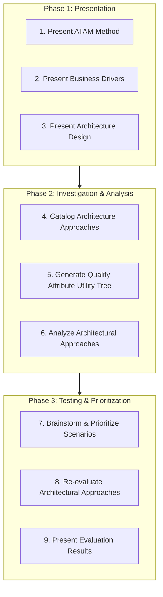
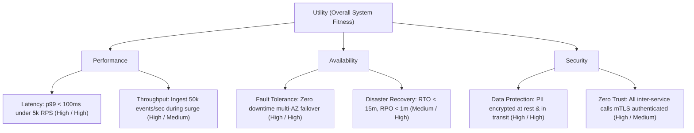

# Architecture Evaluation

## Overview

Architecture Evaluation is the systematic assessment of a software architecture against its business objectives, quality attribute requirements, and organizational constraints prior to or during implementation. Catching an architectural defect or unviable assumption during the design phase costs orders of magnitude less than discovering that a system cannot meet its throughput, latency, or security requirements after it is deployed to production.

The industry gold standard for architectural evaluation is the **Architecture Tradeoff Analysis Method (ATAM)** developed by the Software Engineering Institute (SEI) at Carnegie Mellon University.

---

## The Architecture Tradeoff Analysis Method (ATAM)

ATAM evaluates how an architecture satisfies specific quality attribute scenarios and uncovers the trade-offs and risks inherent in structural design choices.



---

## The Quality Attribute Utility Tree

The Utility Tree provides a structured mechanism for translating high-level business goals into concrete, prioritized quality attribute scenarios:



*Note: Ratings indicate `(Business Importance / Architectural Difficulty)`.*

---

## Key ATAM Findings: Sensitivity, Trade-off, Risk, Non-Risk

During an ATAM evaluation, architectural decisions are categorized into four critical primitives:

```mermaid
classDiagram
    class SensitivityPoint {
        +Property: Parameter directly affecting a quality attribute
        +Example: Buffer size directly dictates message drop rate
    }
    class TradeoffPoint {
        +Property: Affects multiple attributes in opposing directions
        +Example: Synchronous mTLS improves Security but degrades Latency
    }
    class ArchitecturalRisk {
        +Property: Decision that may cause undesirable consequences
        +Example: Single master database without automated failover
    }
    class NonRisk {
        +Property: Decision deemed safe and aligned with requirements
        +Example: Standardizing on TLS 1.3 for external endpoints
    }
```



| Finding Type | Real-World Enterprise Scenario | Architectural Consequence |
|:---|:---|:---|
| **Sensitivity Point** | Cache TTL setting on Product Catalog API | Increasing TTL reduces database load (improves latency) but increases stale inventory exposure. |
| **Trade-off Point** | Adopting distributed 2-Phase Commit (2PC) | Guarantees strong financial consistency (Consistency) but drastically reduces throughput and availability during network partitions. |
| **Architectural Risk** | Using single unpartitioned Redis cluster for both caching and session state | Cache evictions under high memory pressure will wipe user sessions, causing global customer logouts. |
| **Non-Risk** | Deploying stateless API workers behind AWS Application Load Balancer with auto-scaling | Well-understood, proven paved-road pattern capable of meeting anticipated traffic volume. |

---

## Automated Architectural Fitness Functions

In modern continuous delivery environments, evaluation is not a one-time ceremony. Architects implement **Automated Fitness Functions**—tests that execute in CI/CD pipelines to ensure architectural integrity over time:

```csharp
// Example NetArchTest (C#) enforcing Clean Architecture layer boundaries in CI/CD
[Fact]
public void DomainLayer_ShouldNotHaveDependencyOn_InfrastructureLayer()
{
    var result = Types.InAssembly(DomainAssembly)
        .ShouldNot()
        .HaveDependencyOn("Enterprise.Infrastructure")
        .GetResult();

    Assert.True(result.IsSuccessful, "Domain layer must remain pure and free from infrastructure dependencies!");
}
```

### Types of Continuous Fitness Functions
1. **Coupling Fitness Functions**: ArchUnit / NetArchTest verifying that internal layers (Domain, Application) do not reference outer adapters (Web, Infrastructure).
2. **Security Fitness Functions**: Static code analysis breaking builds if cleartext HTTP endpoints or hardcoded secrets are introduced.
3. **Performance Budget Fitness Functions**: Automated k6 / Gatling load tests in staging failing builds if p99 latency exceeds 200ms.
4. **Cloud Cost Fitness Functions**: Infracost analyzing Terraform pull requests to prevent unbudgeted cloud infrastructure spend.
