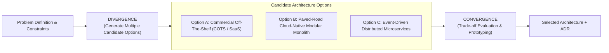
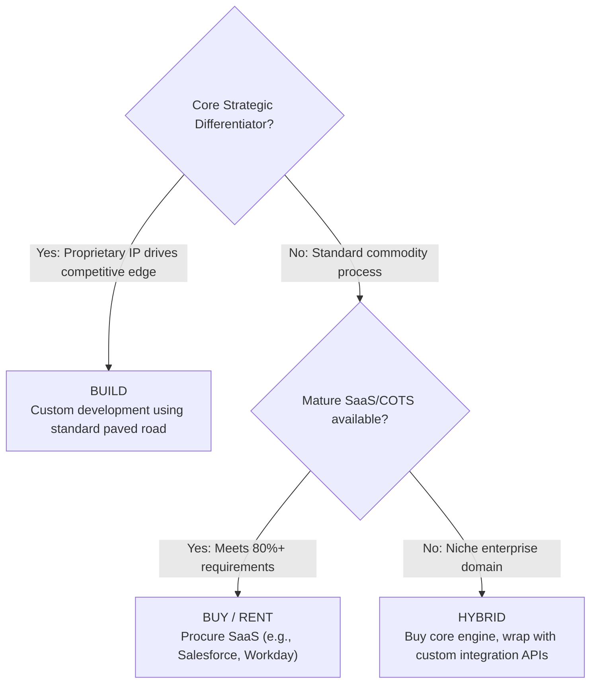

# Architecture Options Analysis

## Overview

Architecture Options Analysis is the disciplined engineering practice of formulating, exploring, and documenting multiple viable architectural alternatives before committing organizational capital to a single design. Premature convergence—selecting the first architecture that comes to mind or adopting the current industry hype—is a primary cause of enterprise project failure and budget overruns.

An experienced Solution Architect never presents a single design in isolation. They present candidate options with contrasting topologies, cost structures, operational trade-offs, and risk profiles to enable informed executive decision-making.

---

## The Divergent-Convergent Architecture Process

---

## Standard Architectural Decision Dilemmas

Every enterprise solution design confronts recurring fundamental choices:

### 1. Build vs. Buy vs. Rent (SaaS)

- **Build**: Maximum control, high upfront capital expenditure, ongoing maintenance burden.
- **Buy / SaaS**: Rapid time-to-market, recurring OPEX subscription, customization constraints, vendor lock-in.

### 2. Monolith vs. Modular Monolith vs. Microservices
- **Modular Monolith**: Recommended default for 90% of new enterprise workloads. Enforces clean domain boundaries within a single deployable unit; minimizes distributed systems latency and DevOps complexity.
- **Microservices**: Justified only when independent scaling, disparate release cadences across autonomous organizational teams (Conway's Law), or polyglot data models are mandatory.

### 3. Synchronous REST/gRPC vs. Asynchronous Event-Driven
- **Synchronous (Request-Response)**: Simple mental model, immediate consistency feedback, but fragile to cascading failures and network latency accumulation.
- **Asynchronous (Event-Driven)**: High temporal decoupling, resilient to downstream outages, superior throughput, but introduces eventual consistency and distributed debugging complexity.

---

## Comparative Options Evaluation Framework

When presenting options to an Architecture Review Board (ARB), use a standardized comparative matrix:

| Evaluation Dimension | Option A: COTS SaaS Platform | Option B: Cloud-Native Modular Monolith | Option C: Event-Driven Microservices |
|:---|:---|:---|:---|
| **Architecture Topology** | Vendor Hosted Multi-Tenant SaaS | Single Docker container on AWS ECS with RDS | 8 Kubernetes microservices + Kafka + DynamoDB |
| **Initial Time to Market** | 3 months (Configuration only) | 6 months (Custom engineering) | 12 months (Infra setup + distributed logic) |
| **Year 1 Capital Cost** | $450,000 (License & Implementation) | $320,000 (Engineering team) | $680,000 (Platform + Infra + Engineering) |
| **Year 3 Recurring TCO** | $250,000/year (Licensing inflation) | $60,000/year (Cloud hosting + minimal ops) | $180,000/year (Kubernetes ops + observability + cloud) |
| **Operational Complexity** | Low (Vendor managed) | Low (Single deployment pipeline, standard SQL) | Very High (Distributed tracing, circuit breakers, Sagas) |
| **Customization Flexibility** | Low (Constrained by vendor plugin API) | High (Full source code ownership) | Very High (Independent polyglot deployment) |
| **Enterprise Paved-Road Fit** | Medium (Third-party data residency risk) | High (Strictly conforms to .NET/Postgres paved road) | Medium (Exceeds team operational maturity) |

---

## Prototyping and Spikes for Option Validation

When theoretical analysis cannot resolve an architectural debate, architects commission **Time-Boxed Architecture Spikes**:
1. **Scope Restriction**: A spike never produces production code. It is an isolated, throwaway proof-of-concept designed solely to answer a specific binary question (e.g., "Can DynamoDB Global Tables support our 50ms multi-region write latency constraint?").
2. **Time-Boxing**: Maximum duration of 3 to 5 business days for 1–2 senior engineers.
3. **Measurable Exit Criteria**: A written summary documenting empirical benchmark numbers, observed failure behaviors, and an explicit recommendation.
