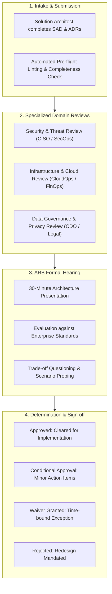
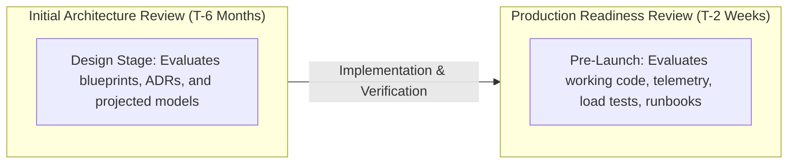

# Architecture Review & Governance

## Overview

The Architecture Review is a formal governance checkpoint designed to evaluate a proposed solution architecture against enterprise standards, security policies, non-functional requirements (NFRs), and operational viability before significant engineering capital is expended. When executed properly, architecture reviews are not obstructive bureaucratic gates; they are collaborative, consultative peer-review sessions that elevate system quality, eliminate blind spots, and de-risk delivery.

In large-scale enterprise environments, architecture reviews are conducted under the auspices of the **Architecture Review Board (ARB)**.

---

## The Architecture Review Board (ARB) Lifecycle



---

## Core Review Criteria & Dimensions

During an ARB session, the panel evaluates the architecture across eight critical enterprise dimensions:

```mermaid
mindmap
  root((ARB Review))
    Strategic Alignment
      Conforms to Target Architecture Roadmap
      Avoids Duplicate Enterprise Capabilities
    Technology Standards
      Uses Sanctioned Paved-Road Stacks
      No Prohibited or EOL Technologies
    Security & Compliance
      Zero Trust Principles Enforced
      Data at Rest & Transit Encrypted
      Regulatory Mandates Met (PCI, HIPAA, GDPR)
    Reliability & DR
      No Single Points of Failure (SPOF)
      RPO and RTO Validated Against Business SLA
    Scalability & Performance
      Empirical Capacity Projections Provided
      Bottlenecks Identified (Database connection pooling, etc.)
    FinOps & Cloud Cost
      Total Cost of Ownership (TCO) Modeled
      Resource Lifecycle Policies Defined
    Operability & Observability
      Structured Logging, OpenTelemetry Tracing
      Health Checks & Circuit Breakers Included
    Extensibility & Maintainability
      Clean Bounded Contexts (DDD)
      Versioned Public API Contracts
```

---

## Review Outcomes and Governance Gates

Every architecture review must conclude with an official written determination:

| Determination | Meaning | Next Steps / Operating Rules |
|:---|:---|:---|
| **Approved** | The architecture strictly complies with all enterprise standards, security baselines, and NFR targets. | Solution moves into active development; no further governance roadblocks. |
| **Conditional Approval** | The architecture is fundamentally sound, but requires minor revisions or remediations before launch. | Delivery may commence; architect must resolve specific "Action Items" prior to Production Readiness Review (PRR). |
| **Architectural Waiver** | The solution deliberately violates a standard (e.g., uses a non-standard database for unique throughput needs). | A formal **Architecture Exception Waiver** is granted with a strict expiration date (e.g., valid for 12 months, followed by mandatory review). |
| **Rejected** | The design possesses critical vulnerabilities, severe cost overruns, unmitigated single points of failure, or violates corporate policy. | System cannot be built or deployed; team must redesign and resubmit for a subsequent hearing. |

---

## Production Readiness Review (PRR) vs. Initial Architecture Review

Architecture governance does not end at design sign-off. The architecture is verified again immediately before commercial launch:



### The PRR Verification Checklist
1. **Load & Stress Testing**: Did the working system survive 150% of peak load in staging with acceptable latency percentiles?
2. **Failure Injection**: Did the system survive the simulated termination of its primary database cluster without data loss?
3. **Observability**: Are distributed trace IDs propagating across all microservice boundaries to Datadog/Grafana?
4. **Runbooks & Pagers**: Are alert thresholds tuned, runbooks documented, and on-call rotations configured in PagerDuty?
