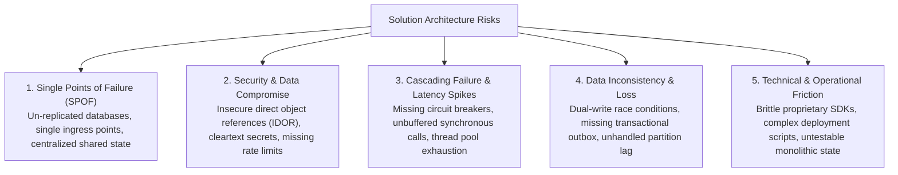
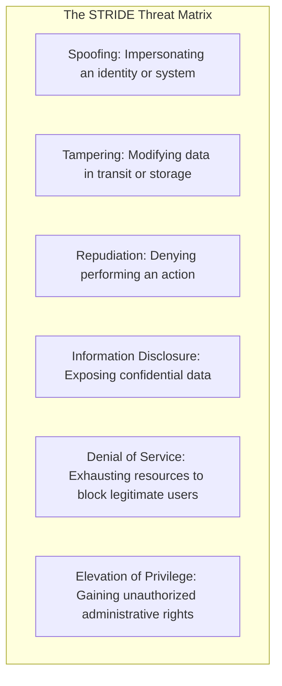
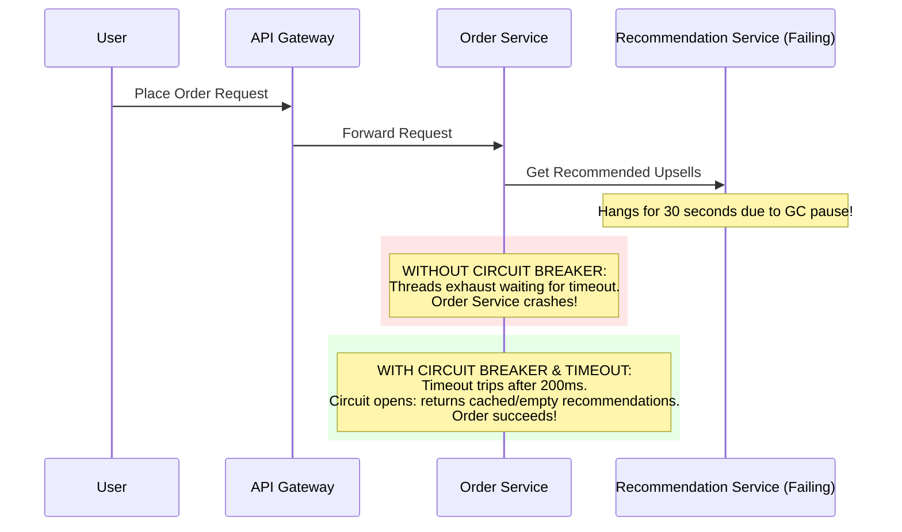
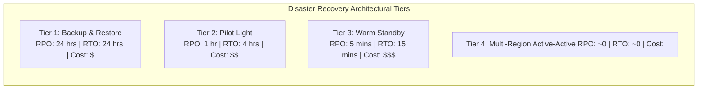

# Solution Architecture Risk Management

## Overview

Solution Architecture Risk Management focuses on identifying, isolating, and mitigating structural risks within a specific solution design before they materialize in production as outages, security breaches, data corruption, or unrecoverable latency spikes. While Enterprise Architecture risk manages multi-year portfolio and vendor obsolescence risks, Solution Architecture risk manages the tactical, concrete engineering realities of a system's runtime architecture and implementation.

---

## Solution-Level Risk Taxonomy

---

## Architecture Threat Modeling: STRIDE

The Solution Architect conducts threat modeling during the initial design elaboration stage using the Microsoft STRIDE methodology:

### STRIDE Applied to a Microservices Architecture

| STRIDE Threat | Architectural Vulnerability | Concrete Solution Mitigation |
|:---|:---|:---|
| **Spoofing** | Compromised microservice impersonates another internal service | Enforce Mutual TLS (mTLS) with SPIFFE/SPIRE x509 cryptographic identities. |
| **Tampering** | Man-in-the-middle attacker tampers with HTTP query parameters | Enforce TLS 1.3 encryption across all internal VPC networks; HMAC payload signing for webhooks. |
| **Repudiation** | Malicious user transfers funds and claims the action was unauthorized | Append immutable audit logs with cryptographic hash-chaining to AWS CloudTrail / WORM S3 buckets. |
| **Information Disclosure** | Application logs contain unmasked credit card numbers or JWT tokens | Automated PII masking filters in Logback / Serilog; encrypt all volumes at rest using AWS KMS CMKs. |
| **Denial of Service** | Public registration endpoint flooded with 100,000 automated bot requests | Cloudflare WAF + AWS API Gateway Token Bucket rate limiting + CAPTCHA verification. |
| **Elevation of Privilege** | Normal tenant user alters URL parameter `/users/42` to view admin dashboard | Enforce attribute-based access control (ABAC) verified in application middleware; deny by default. |

---

## Mitigating Cascading Failures

In distributed solution architectures, the failure of a single downstream service must never be allowed to cascade and crash the entire system:

### Essential Resilience Patterns
1. **Aggressive Timeouts**: Never allow network calls to wait indefinitely; default to sub-second timeouts.
2. **Circuit Breakers**: Stop traffic to failing downstream dependencies immediately to allow them time to recover.
3. **Bulkheads**: Isolate thread pools and connection pools so that a failure in a secondary reporting query cannot exhaust connections needed for primary transactions.
4. **Idempotent Consumers**: Ensure all event consumers can safely process duplicate messages without producing side effects.

---

## Disaster Recovery & Recovery Metrics (RPO / RTO)

Every solution design must formally define its Disaster Recovery (DR) tier:

- **Recovery Point Objective (RPO)**: The maximum acceptable data loss measured in time (e.g., "At most 5 minutes of data loss").
- **Recovery Time Objective (RTO)**: The maximum acceptable duration of downtime before the system is restored (e.g., "Must be operational within 15 minutes").

### Verification via Chaos Engineering
Solution architects do not assume high availability works; they prove it using automated fault injection (e.g., Chaos Mesh, AWS Fault Injection Simulator) to randomly terminate containers, simulate network latency, and force primary database failovers in pre-production.
