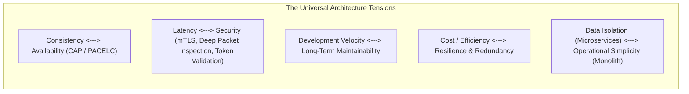
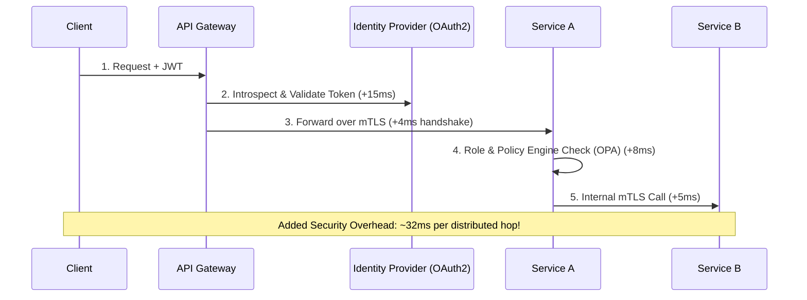
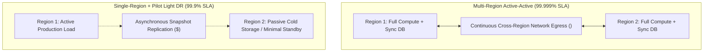

# Solution Architecture Trade-Offs

## Overview

> "There are no solutions in software architecture; there are only trade-offs. An architect who thinks they have found a solution hasn't discovered the trade-off yet." — Mark Richards & Neal Ford

Solution Architecture is the deliberate management of conflicting quality attributes and organizational forces. Every design decision that enhances one architectural property simultaneously degrades one or more others. The role of the Solution Architect is not to pursue impossible perfection, but to identify, quantify, and negotiate the **least-worst combination of trade-offs** that satisfies the core business drivers.

---

## Canonical Enterprise Architecture Trade-Offs

---

## Deep-Dive Trade-Off Analyses

### 1. Latency vs. Security & Governance

- **Forces**: Security demands cryptographic validation, zero-trust token inspection at every boundary, and end-to-end audit logging. Performance demands microsecond response times and minimal network hops.
- **Architectural Resolution**: Use local asymmetric public-key caching with short-lived JWTs (eliminating remote IdP round-trips); utilize persistent HTTP/2 or gRPC keep-alive connection pools to amortize TLS handshake latency.

### 2. Immediate Consistency vs. High Availability

- **Forces**: Financial systems demand absolute ACID guarantees—no account can ever be double-debited. Global scale demands 99.999% availability across multi-region data centers.
- **Architectural Resolution**: Apply **Domain Partitioning**. Reserve strong linearizable consistency strictly for the high-risk monetary ledger via two-phase commit or transactional consensus (CockroachDB/Spanner). Decouple all secondary workflows (notifications, order history, analytics) using asynchronous event streams (Kafka) and eventual consistency.

### 3. Cloud Cost vs. Extreme Resilience

- **Cost Impact**: Multi-region active-active architectures cost **2.5x to 4x** more in infrastructure hosting, multi-region replication egress fees, and distributed data conflict resolution tooling.
- **Architectural Resolution**: Map availability tiers directly to business revenue loss. A system generating $100/hour in revenue cannot justify a $50,000/month active-active multi-region deployment.

---

## The Trade-off Decision Matrix (Spider / Radar Analysis)

To articulate complex trade-offs to non-technical stakeholders, architects employ multi-attribute radar comparisons:

| Architectural Attribute | Option A: Monolithic Architecture | Option B: Microservices Architecture | Option C: Serverless Event-Driven |
|:---|:---:|:---:|:---:|
| **Initial Delivery Velocity** | 9 / 10 | 4 / 10 | 7 / 10 |
| **Independent Scalability** | 3 / 10 | 9 / 10 | 10 / 10 |
| **Operational Simplicity** | 9 / 10 | 3 / 10 | 5 / 10 |
| **Cost Predictability** | 8 / 10 | 5 / 10 | 4 / 10 |
| **Data Consistency** | 10 / 10 | 4 / 10 | 5 / 10 |
| **Fault Isolation** | 3 / 10 | 9 / 10 | 8 / 10 |
| **Team Autonomy (Conway's Law)**| 4 / 10 | 10 / 10 | 7 / 10 |

---

## Communicating Trade-Offs to Executive Leadership

When presenting architecture trade-offs to business executives, follow the **Triple-Constraint Translation**:
1. **Never present purely technical jargon**: Do not say "Cassandra gives us AP over CP under network partition." Say "This database design guarantees our mobile checkout never crashes during traffic surges, but orders may take up to 2 seconds to appear on customer dashboards."
2. **Quantify the downside**: Explicitly state the financial, operational, or velocity cost of the chosen direction.
3. **Document explicit sign-off**: Ensure business owners formally sign off on the trade-offs in the ADR.
