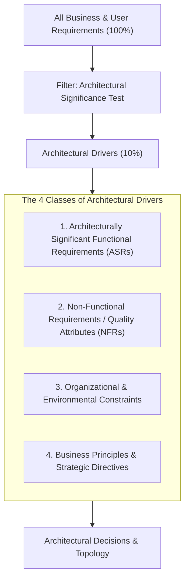
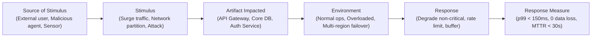
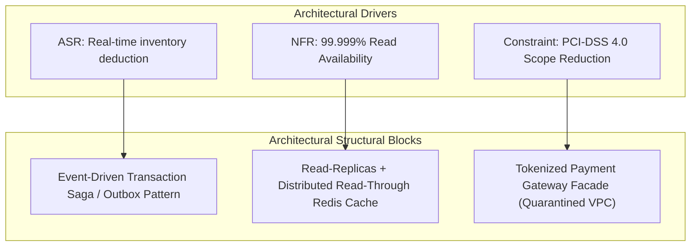

# Requirements to Architecture

## Overview

Translating business requirements into an architectural blueprint is the most critical and difficult intellectual leap in solution design. Business stakeholders articulate requirements in terms of user outcomes, revenue targets, regulatory compliance, and operational workflows. Engineers require concrete boundaries, communication protocols, persistence models, and concurrency controls.

The Solution Architect synthesizes ambiguous, evolving business desires into prioritized **Architectural Drivers**—the subset of functional and non-functional requirements that fundamentally dictate system topology.

---

## The Architectural Driver Funnel

Not all requirements shape architecture. Ninety percent of user stories are straightforward business logic implemented within established component boundaries. The Solution Architect isolates the 10% that exert architectural gravity:

---

## 1. Isolating Architecturally Significant Requirements (ASRs)

An ASR is a requirement that satisfies at least one of the following criteria:
- **Broad Structural Impact**: Influences multiple subsystems or external third-party integrations (e.g., "All transactions must be audited in real-time by an external fraud system").
- **High Concurrency / Performance Gravity**: Requires specialized data structures, caching layers, or asynchronous pipelines (e.g., "System must handle 100,000 bids/sec in a 5-minute auction window").
- **Strict Data Consistency**: Requires distributed consensus or atomic multi-party coordination (e.g., "Ledger balances must never be overdrawn across multi-region deposits").
- **Irreversibility / High Cost of Change**: Decisions that would require months of engineering rework if modified later (e.g., event sourcing vs. CRUD relational storage).

---

## 2. Converting Ambiguous Desires into Measurable Scenarios

Architects avoid single-word quality attributes ("scalable", "resilient", "secure") because they cannot be tested or designed against. Instead, use **Architecture Quality Scenarios** (SEI / Bass, Clements, Kazman method):

### Concrete Transformation Examples

| Raw Business Requirement | Architectural Driver Type | Operational Architecture Scenario | Concrete Technical Decision |
|:---|:---|:---|:---|
| *"The mobile app should feel instantaneous during Black Friday."* | Performance & Scalability (NFR) | Under 15,000 RPS checkout traffic, product detail page renders with p95 < 200ms and p99 < 500ms while inventory is updated within 1 second. | Multi-tier CDN caching for catalog reads + Redis cache clusters + SQS/Kafka write buffering for order ingestion. |
| *"We need to comply with international banking rules."* | Regulatory & Security (Constraint) | When an EU resident requests data deletion under GDPR, all PII across OLTP and analytics must be purged or anonymized within 72 hours with cryptographic verification. | Cryptographic erasure (crypto-shredding) where user encryption keys are deleted from Vault, rendering backups instantly unreadable. |
| *"We want to be able to switch cloud providers easily."* | Portability (Constraint) | When shifting container workloads from AWS to GCP, no proprietary managed APIs should require application source-code refactoring. | Abstain from proprietary services (e.g., DynamoDB streams); standardize on Kubernetes, Kafka, and PostgreSQL. |

---

## 3. Mapping Requirements to Architectural Building Blocks

Once drivers are prioritized, the architect maps them to functional and technical structural components:

---

## Common Pitfalls in Requirements Translation

1. **Solution Bias in Requirements**: Business asks for "a blockchain database" when all they need is an immutable audit log table with hash-chaining in PostgreSQL. The architect must drill down using the "5 Whys" to uncover the underlying invariant.
2. **Treating All Requirements as Equal**: Designing every microservice to achieve 99.999% availability inflates cloud spend by 10x. Only mission-critical transaction paths warrant Tier-0 redundancy; back-office reporting can operate at 99.5%.
3. **Ignoring Latent Requirements**: Failing to design for operational observables (telemetry, tracing, correlation IDs) and operational maintenance (data purging, schema migrations) until after production launch.
