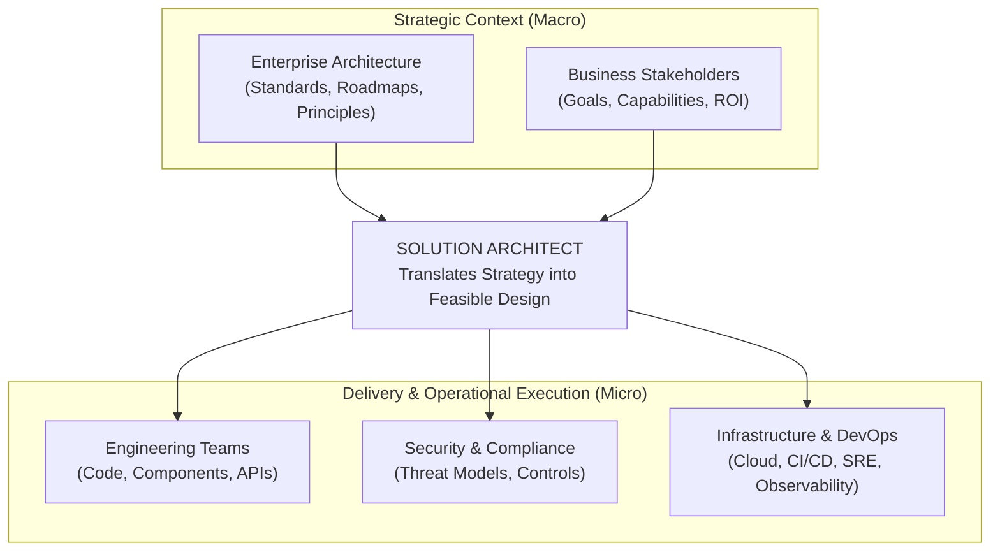
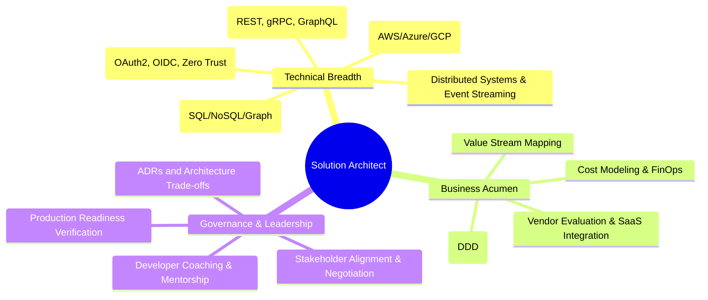

# Solution Architecture Overview

## Overview

Solution Architecture (SA) is the practice of designing, describing, and managing the technical implementation of a specific business solution in response to an enterprise problem or opportunity. While Enterprise Architecture (EA) operates at the strategic macro-level across the entire organization, Solution Architecture bridges the gap between enterprise strategy and technical execution, designing concrete, end-to-end systems that satisfy functional and non-functional requirements within organizational constraints.

The Solution Architect serves as the connective tissue between business stakeholders, enterprise architecture governance, engineering delivery teams, and infrastructure operations.

---

## The Role of the Solution Architect

---

## Scope Comparison: EA vs. SA vs. Technical/Software Architect

| Dimension | Enterprise Architect (EA) | Solution Architect (SA) | Technical / Software Architect (TA) |
|:---|:---|:---|:---|
| **Scope of Impact** | Entire enterprise / multi-business unit | Single comprehensive business solution / product ecosystem | Single subsystem, service, codebase, or framework |
| **Time Horizon** | 3 – 7 years (Strategic) | 1 – 3 years (Solution lifecycle) | Current sprint to 6 months (Tactical delivery) |
| **Primary Deliverables**| Business capability maps, technology standards, TIME rationalization, roadmaps | Solution Architecture Document (SAD), C4 diagrams, ADRs, integration specs | Class diagrams, design patterns, schema definitions, low-level PR reviews |
| **Key Stakeholders** | CIO, CTO, VP Engineering, Business Executives | Product Managers, Engineering Managers, Tech Leads, SecOps | Software Engineers, QA Leads, DevOps Engineers |
| **Primary Focus** | Standardization, portfolio optimization, technical debt reduction | End-to-end viability, NFR satisfaction, system integration, trade-offs | Code quality, algorithmic performance, library choices, refactoring |

---

## Core Competencies of a Modern Solution Architect

---

## The Solution Architecture Lifecycle

A solution architecture evolves through four distinct phases across the product development lifecycle:

1. **Inception & Discovery**: Uncovering the root business problem, mapping domain boundaries, identifying stakeholders, and capturing functional and non-functional requirements (NFRs).
2. **Architecture Elaboration & Design**: Formulating architectural options, conducting trade-off analyses (e.g., ATAM), selecting technologies from approved enterprise standards, creating C4 model architecture diagrams, and documenting decisions via ADRs.
3. **Execution & Delivery Governance**: Partnering with engineering teams during sprints, validating proof-of-concepts (POCs), preventing architecture drift, and updating designs as implementation constraints emerge.
4. **Operations & Evolution**: Reviewing production telemetry (latency percentiles, error budgets, cloud spend), conducting post-incident architectural reviews, and planning evolutionary refactoring.
