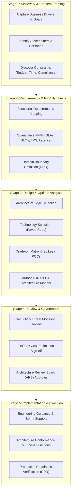

# Solution Architecture Process

## Overview

The Solution Architecture Process is a structured, repeatable methodology for translating business objectives, stakeholder constraints, and functional needs into an operable, scalable, and secure technical solution. In modern agile and product-led enterprise environments, the architecture process is not a waterfall stage-gate that produces stale shelfware; it is an iterative, collaborative lifecycle that evolves alongside continuous delivery.

---

## End-to-End Solution Architecture Workflow

---

## Detailed Stage Breakdown

### Stage 1: Discovery & Problem Framing
- **Input**: Business business case, executive charter, or product PRD (Product Requirements Document).
- **Core Activity**: Unpack the true business driver. Distinguish between what the business *asks for* (e.g., "we need Kafka") and what the business *actually needs* (e.g., "we need real-time fraud alert delivery under 200ms").
- **Output**: Problem Statement, Business Value Metric, Initial Stakeholder Map.

### Stage 2: Requirements & NFR Synthesis
- **Input**: User stories, domain workflows, compliance requirements.
- **Core Activity**: Transform vague quality wishes into precise, measurable Non-Functional Requirements (NFRs).
  - *Vague*: "The system must be fast and reliable."
  - *Architectural*: "The payment authorization API must achieve p99 latency $\le 120\text{ms}$ at $5,000\text{ TPS}$ with 99.99% availability (max 52.6 minutes unplanned downtime/year)."
- **Output**: Quantitative NFR Specification, Bounded Context Map.

### Stage 3: Design & Options Analysis
- **Input**: NFRs, enterprise technology standards, organizational constraints.
- **Core Activity**: Formulate at least 2–3 viable architectural candidate topologies. Build throwaway prototypes (technical spikes) to validate unknowns (e.g., benchmark database write throughput). Perform trade-off analysis.
- **Output**: Solution Architecture Document (SAD), C4 Models (Context, Container, Component), Architecture Decision Records (ADRs).

### Stage 4: Review & Governance
- **Input**: Draft architecture deliverables, threat models, cost projections.
- **Core Activity**: Cross-functional alignment sessions:
  - **Security Review**: STRIDE threat model, zero-trust validation, data privacy (PII/GDPR).
  - **FinOps Review**: Cloud cost projections at 1x, 5x, and 10x scale.
  - **ARB Review**: Validation against enterprise principles and paved-road tech stacks.
- **Output**: Formal Architecture Approval, Architecture Waivers (if non-standard technologies are justified).

### Stage 5: Implementation & Evolution
- **Input**: Approved architecture, backlog items.
- **Core Activity**: The architect embeds with delivery teams. Write architectural unit tests (e.g., ArchUnit / NetArchTest) as automated fitness functions to prevent coupling violations. Conduct Production Readiness Review (PRR) prior to general availability.
- **Output**: Verified Production System, Telemetry Dashboards, Operational Runbooks.

---

## The Solution Architect's Delivery Checklist

| Checkpoint | Validation Question | Artifact Produced |
|:---|:---|:---|
| **Problem Alignment** | Does this architecture directly solve the funded business problem without over-engineering? | Executive Architecture Summary |
| **Paved Road Conformance** | Does the design adhere to enterprise technology standards, or does it introduce unvetted tech? | Technology Radar Assessment |
| **Measurable NFRs** | Are scalability, availability, security, and latency backed by empirical metrics and load tests? | NFR Matrix |
| **Disaster Recovery** | Are RPO and RTO explicitly architected and testable via automated failover drills? | DR Strategy Specification |
| **Cost Predictability** | Is the multi-year total cost of ownership (TCO) modeled with clear inflection points? | Cloud FinOps Model |
