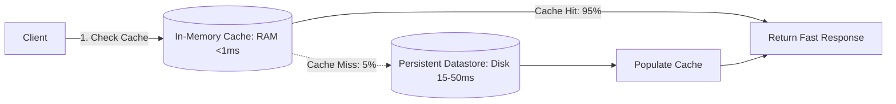

# Caching Architecture & Engineering

## 1. Overview & Architectural Philosophy
Caching is the temporary storage of computationally expensive or high-latency data in fast storage media (typically RAM) to accelerate subsequent retrieval. In modern distributed systems, caching transforms storage economics and request latency, dropping access times from tens of milliseconds to sub-millisecond ranges.

---

## 2. Universal Caching Invariants
* **Cache is an Optimization, Not the Source of Truth**: The system must operate correctly (albeit slower) if the entire caching tier is wiped out.
* **The Invalidation Challenge (Phil Karlton)**: *"There are only two hard things in Computer Science: cache invalidation and naming things."*
* **Working Set Locality**: Exploits Temporal Locality (data accessed recently will be accessed again soon) and Spatial Locality (data located nearby will be accessed together).

---

## 3. Directory Structure
* [Caching Strategies](caching-strategies.md)
* [Cache-Aside (Lazy Loading)](cache-aside.md)
* [Read-Through](read-through.md)
* [Write-Through](write-through.md)
* [Write-Behind (Write-Back)](write-behind.md)
* [Cache Eviction Policies](cache-eviction.md)
* [LRU (Least Recently Used)](lru-cache.md)
* [LFU (Least Frequently Used)](lfu-cache.md)
* [FIFO Cache](fifo-cache.md)
* [Cache Stampede (Thundering Herd)](cache-stampede.md)
* [Cache Penetration](cache-penetration.md)
* [Cache Breakdown](cache-breakdown.md)
* [Cache Avalanche](cache-avalanche.md)
* [Distributed Cache](distributed-cache.md)
* [Redis Architecture](redis-architecture.md)
* [Memcached Architecture](memcached-architecture.md)
* [Multi-Level Caching](multi-level-caching.md)
* [Cache Invalidation](cache-invalidation.md)
