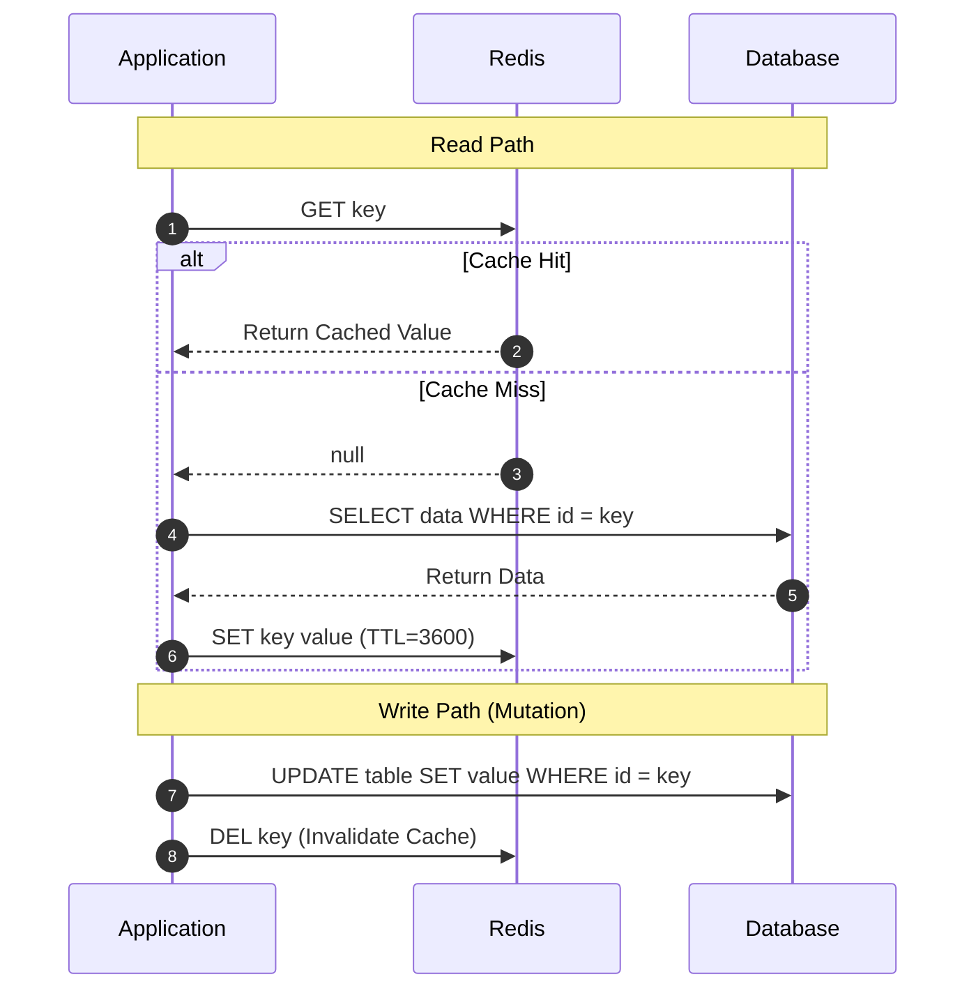

# Cache-Aside Pattern (Lazy Loading)

## 1. Principles of Cache-Aside
Cache-Aside is the most widely deployed caching architecture. The application code sits between the cache and the primary datastore, orchestrating both reads and writes.

---

## 2. Why Invalidate (DEL) Instead of Update (SET)?
When modifying data in the database, **always delete the key from cache rather than updating it**:
* **Prevents Race Conditions**: If two concurrent threads execute writes out of order ($W_1$ then $W_2$), updating cache directly can result in $W_1$ overwriting $W_2$'s cache entry, leaving stale data indefinitely.
* Deleting the key forces the next reader to atomically reload the freshest database state.
