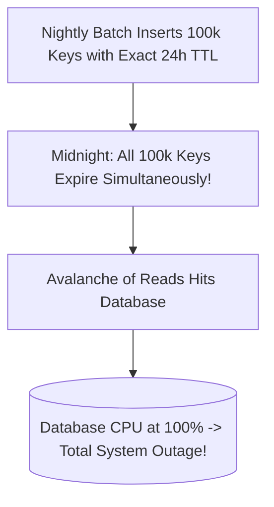

# Cache Avalanche Defense

## 1. The Avalanche Failure Mode
A **Cache Avalanche** occurs when either:
1. A massive volume of cached keys share the exact same expiration time and expire simultaneously, sending a sudden tidal wave of queries to the database.
2. The entire cache cluster crashes or reboots under load, leaving the database completely exposed.

---

## 2. Core Architectural Defenses

### 1. TTL Randomization (Jitter)
Never configure static TTLs for bulk-populated keys. Inject randomized jitter:
$$\text{TTL}_{\text{effective}} = \text{TTL}_{\text{base}} + \text{Random}(0, \Delta t)$$
* If base TTL is 24 hours ($86,400\text{ s}$), add random jitter between $0$ and $3,600\text{ seconds}$ (1 hour). Keys expire smoothly over a 60-minute window rather than a single millisecond.

### 2. High-Availability Cluster Topologies
Deploy Redis in a multi-master, multi-replica cluster topology spanning multiple Availability Zones with automated Sentinel/Cluster failover to prevent total cluster loss.
