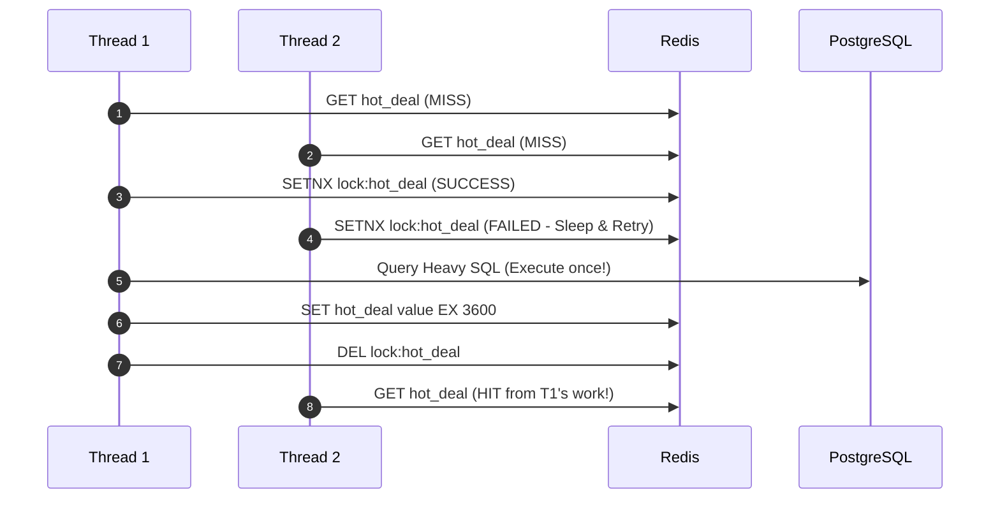

# Cache Breakdown Defense

## 1. Breakdown vs. Avalanche
* **Cache Avalanche**: Thousands of disparate keys expiring simultaneously.
* **Cache Breakdown**: A **single ultra-hot key** (e.g., breaking news, viral discount) expiring, unleashing a thundering herd.

---

## 2. Defensive Architectures

### 1. Singleflight / Mutex Locking Pattern
When a cache miss occurs, the thread must acquire a distributed lock before querying the database. All other concurrent threads wait for the lock or poll the cache:

### 2. Logical Expiration (Never Expire in Cache)
Store data with a logical expiration timestamp in the payload, without setting a Redis physical TTL. A background worker periodically re-populates the key before the logical timestamp lapses.
