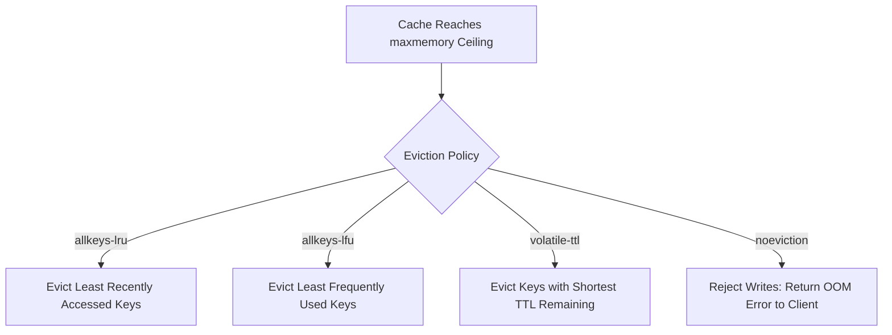

# Cache Eviction Policies

## 1. Principles of Memory Eviction
When cache RAM reaches its configured threshold (`maxmemory` in Redis), the system must evict existing keys to accommodate incoming allocations.

---

## 2. Redis Eviction Directives
* `noeviction`: Returns errors on writes when memory limit is reached (preserves all data).
* `allkeys-lru`: Evicts least recently used keys among the entire keyspace.
* `volatile-lru`: Evicts least recently used keys among keys that have an explicit `EXPIRE` set.
* `allkeys-lfu`: Evicts least frequently used keys (tracks access frequency counters).
* `volatile-ttl`: Evicts keys with the shortest time-to-live.
