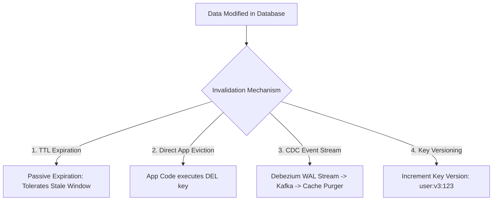

# Cache Invalidation Architecture

## 1. Invalidation Methodologies
Cache invalidation ensures that modifications in persistent systems are accurately reflected in caching tiers.

---

## 2. The Cache-Aside Race Condition & The Dual-Delete Pattern

### The Invalidation Race Condition
1. Thread 1 reads DB (value $A$).
2. Thread 2 updates DB to value $B$ and evicts cache (`DEL`).
3. Thread 1 populates cache with stale value $A$!

### The Delayed Double-Delete Pattern
To eliminate this race condition in high-concurrency architectures:
1. Application updates primary database.
2. Application deletes cache key immediately.
3. Application schedules an asynchronous delayed deletion of the cache key **$500\text{ ms}$ later**.
4. The delayed deletion purges any stale data populated by lagging read threads during the mutation window.
