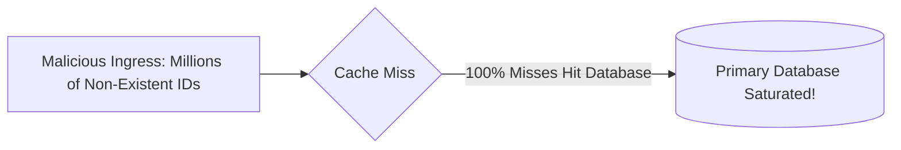

# Cache Penetration Defense

## 1. Defining Cache Penetration
Cache penetration occurs when queries target keys that **exist neither in the cache nor in the database** (e.g., malicious requests for `user_id = -999999` or random UUIDs). Every request bypasses the cache entirely and lands directly on the persistent database.



---

## 2. Core Architectural Defenses

### 1. Bloom Filter Interception
Deploy a **Bloom Filter** in front of the cache. The Bloom filter contains the set of all valid database keys.
* If Bloom filter returns **"Definitely Not Present"**: Reject the request immediately at the edge without querying cache or database.
* If Bloom filter returns **"Probably Present"**: Proceed to cache.

### 2. Null Object Caching
When a database query returns null, store a placeholder entry in the cache with a short TTL (e.g., 30–60 seconds):
```json
SET "user:-999999" "NULL" EX 60
```
