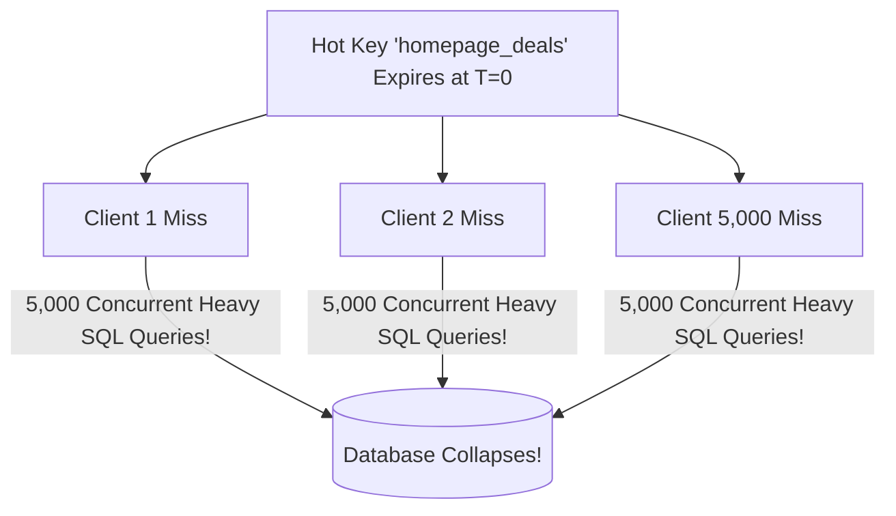

# Cache Stampede (Thundering Herd)

## 1. The Phenomenon
A **Cache Stampede** occurs when a high-traffic cache key expires, and thousands of concurrent client requests simultaneously observe a cache miss and execute the expensive database query in parallel.

---

## 2. Mathematical Mitigation: Probabilistic Early Expiration (XFetch)
Instead of waiting for the key to expire, readers compute a probabilistic formula to decide whether to asynchronously refresh the key *before* it expires:

$$\Delta - \beta \times \delta \times \ln(\text{random}()) \le 0$$
Where:
* $\Delta$ = Time remaining until expiration
* $\delta$ = Time required to compute the database query
* $\beta$ = Aggressiveness factor ($>0$)
* As the key approaches expiration, the probability of a background thread refreshing it approaches $1.0$, guaranteeing zero downtime.
