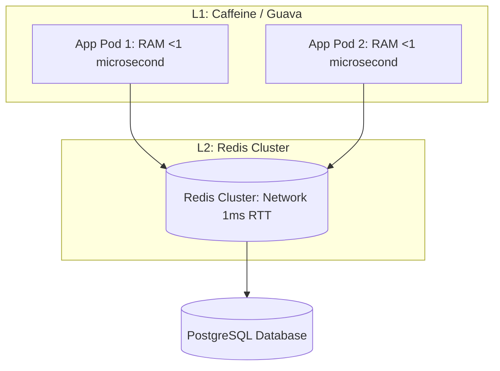

# Caching Strategies & Topologies

## 1. Topologies: In-Process vs. Distributed Cache

| Dimension | In-Process (L1) Cache | Distributed (L2) Cache |
| :--- | :--- | :--- |
| **Access Latency** | Nanoseconds to Microseconds ($<1\ \mu\text{s}$) | Milliseconds ($0.5\text{--}2.0\text{ ms}$) |
| **Consistency** | Risk of split cache across pods | Single shared source of truth |
| **Capacity** | Constrained by JVM/process RAM | Terabytes across clustered shards |
| **Network Overhead**| Zero | Network hop required |
