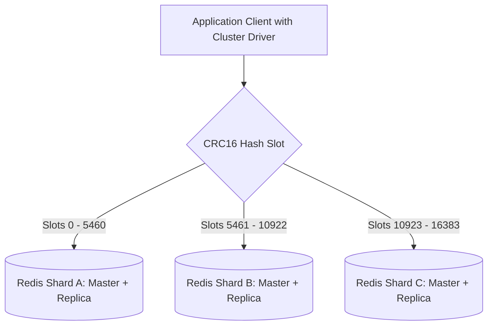

# Distributed Cache Architecture

## 1. Architecture of Distributed In-Memory Clusters
A distributed cache pools RAM across multiple independent server instances, providing unified key-value access through client-side consistent hashing or cluster-aware routing proxies.

---

## 2. Dynamic Slot Migration & Rebalancing
In Redis Cluster, the keyspace is partitioned into **$16,384$ hash slots**:
$$\text{Slot} = \text{CRC16}(\text{key}) \pmod{16384}$$
* Adding Shard D transfers a fraction of hash slots from Shards A, B, and C to Shard D without cluster downtime.
* In-flight requests during migration are redirected seamlessly via `MOVED` and `ASK` cluster protocol responses.
