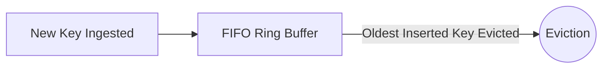

# First-In, First-Out (FIFO) Cache

## 1. Concept & Operation
FIFO evicts items strictly in the order they were inserted, regardless of access frequency or recency.

---

## 2. Production Evaluation
* **Advantage**: Zero tracking overhead; requires no timestamps or doubly linked list adjustments on read operations.
* **Disadvantage**: Poor hit ratios for temporal workloads; frequently evicts high-traffic keys simply because they were inserted earlier.
