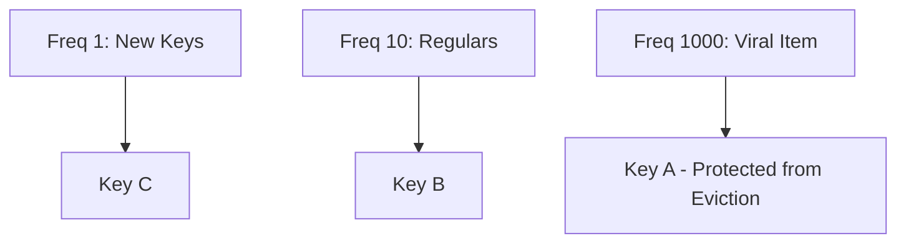

# Least Frequently Used (LFU) Cache

## 1. Algorithmic Mechanics
LFU evicts keys with the lowest access frequency. It protects popular items that may not have been accessed in the last few minutes from being flushed out by sudden bursts of transient data.

---

## 2. Frequency Decay (Morris Counter)
In Redis LFU, each key stores an 8-bit logarithmic counter coupled to an access timestamp.
* **Logarithmic Increment**: Counter increments probabilistically; higher values require exponentially more hits to increment.
* **Decay Pacing**: If a key has not been accessed for $N$ minutes, its frequency counter is halved (`lfu-decay-time`), preventing older historical spikes from permanently squatting in RAM.
