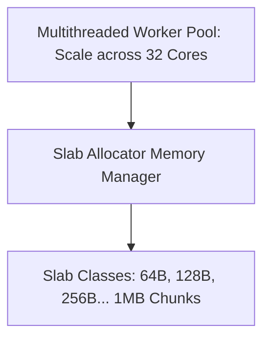

# Memcached Architecture

## 1. Multithreaded In-Memory Key-Value
Unlike Redis, **Memcached utilizes a multithreaded architecture** that scales across multiple CPU cores on a single host.

---

## 2. Slab Allocation (Zero Fragmentation)
Traditional dynamic memory allocation (`malloc`/`free`) causes catastrophic memory fragmentation over time.
* Memcached pre-allocates memory into **Slab Classes** of fixed-size chunks (e.g., Slab 1 = 96-byte chunks, Slab 2 = 120-byte chunks).
* Keys are assigned to the closest fitting slab class, guaranteeing **zero OS memory fragmentation**.

---

## 3. Redis vs. Memcached Selection Matrix
* **Choose Memcached**: Simple string key-value caching on large multi-core hosts; zero requirement for persistence, replication, or complex data structures.
* **Choose Redis**: Rich data structures (Sets, Sorted Sets, Hashes, Streams), pub/sub messaging, master-replica replication, cluster failover, and disk persistence.
